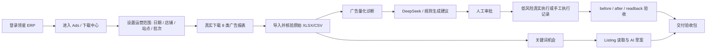

# Amazon AI Ops Business UI Redesign Implementation Plan

> **For agentic workers:** REQUIRED SUB-SKILL: Use superpowers:subagent-driven-development (recommended) or superpowers:executing-plans to implement this plan task-by-task. Steps use checkbox (`- [ ]`) syntax for tracking.

**Goal:** Rebuild the desktop app into a clear Amazon ads operations console: real Lingxing report files first, then quantitative ad diagnosis, AI-assisted recommendations, approval/readback, keyword opportunities, Listing optimization, and final delivery evidence.

**Architecture:** Stop treating `v1.5 工作台` as an embedded all-in-one page. Keep one app shell, one global operation scope, and split daily business workflows into first-class menu pages. Move technical audit output behind detail drawers or dedicated delivery pages. Downstream actions must be gated by real report files and DB-imported ad metrics, not by optimistic batch labels.

**Tech Stack:** Electron 28, React 18, Zustand, Vite, TypeScript, better-sqlite3, Playwright-based smoke scripts, existing Lingxing collector/parser/rules/AI packages.

---

## Current Findings

- `apps/desktop/src/renderer/App.tsx` is a 170k+ line monolith containing shell, dashboard, recommendations, settings, scheduler, data collection, keyword, Listing, delivery, inline styles, audit panels, command snippets, and user flow copy.
- The current sidebar is partially split, but core workflows are still effectively hidden inside `V15Workspace`, and business pages still mix user actions with audit/debug material.
- The dashboard still uses RMB in places; this project is cross-border Amazon ads and the default display currency for the current US scope must be USD.
- The user-facing blocker is not just UI style: if no original Lingxing XLSX/CSV files are downloaded and imported, there is no reliable ad data for quantitative diagnosis, recommendations, or Listing/keyword decisions.
- `C:\Users\wz\.codex\config.toml` contains a `[mcp_servers.stitch]` entry, but the current tool list does not expose a callable Stitch MCP tool. Stitch must be verified before claiming generated designs.
- Existing useful IPC handlers include:
  - `v1_5:reports:collect-lingxing`
  - `v1_5:reports:preflight-lingxing-collection`
  - `v1_5:reports:export-acceptance-audit`
  - `v1_5:reports:diagnose-download-center`
  - `v1_5:reports:open-path`
  - `recommendations:get`
  - `recommendations:generate`
  - `recommendations:approve`
  - `recommendations:reject`
  - `recommendations:export-ad-readback-evidence`
  - `v1_5:keywords:*`
  - `v1_5:listing:*`

## Product Workflow Target



## Final Menu Structure

- **运营总览**
  - `仪表盘`: current scope health, real data freshness, KPI, next action.
- **数据与量化**
  - `数据采集`: Lingxing report create/download/import/audit only.
  - `广告量化`: metrics reconciliation, ACOS/CVR/CPC/order/spend analysis, configurable thresholds.
- **广告执行**
  - `优化建议`: generated ad recommendations, evidence, AI/rule source, current/recommended value.
  - `审批中心`: approve/reject queue and approval scope.
  - `执行回读`: execution evidence, before/after, readback verification.
- **关键词与 Listing**
  - `关键词机会`: deduped opportunities by ASIN/campaign/ad group/keyword/search term.
  - `Listing 优化`: Lingxing listing read, coverage, AI draft, export.
- **系统与交付**
  - `定时任务`
  - `设置`: DeepSeek, rule thresholds, storage, safety.
  - `交付验收`: final manifest, evidence package, installer readiness.

## Global UI Rules

- No large technical command blocks in business pages.
- Audit JSON, selectors, diagnostics, and CLI commands live in collapsed `技术细节` panels or `交付验收`.
- Every page must show what it is for, current scope, what is missing, and the next safe action.
- Use USD formatting by default for US marketplace:

```ts
const currencyFormatter = new Intl.NumberFormat('en-US', {
  style: 'currency',
  currency: 'USD',
});
```

- A batch is not a user concept by itself. Show it as `数据批次`, explain source and status, and link to original files.
- Downstream buttons are disabled when required upstream evidence is absent:
  - No original files -> no ad quantification.
  - No imported metrics -> no recommendations.
  - No recommendation evidence -> no approval.
  - No approval/readback fields -> no delivery ready claim.

## Validation Policy

- During development: run only targeted checks for the changed group.
- After each UI group: run renderer typecheck/build and the relevant smoke script.
- Do not repeatedly run full repo tests.
- Final node only:

```powershell
pnpm -r run typecheck
node scripts/run-tests.js
pnpm --filter @amazon-ai-ops/desktop run build:win
Get-FileHash apps/desktop/release/AmazonAIOpsAgent-1.5.0.exe -Algorithm SHA256
```

---

## Task 0: Worktree, Safety, and Stitch Availability

**Files:**
- Read: `C:\Users\wz\.codex\config.toml`
- Read: `AGENTS.md`
- Create: `docs/superpowers/plans/2026-06-12-amazon-ai-ops-business-ui-redesign.md`
- Modify only if explicitly needed later: no app code in this task.

- [x] **Step 1: Confirm current branch and dirty files**

Run:

```powershell
git status --short --branch
```

Expected:

```text
Current branch and any dirty files are known before edits.
```

- [x] **Step 2: Confirm Stitch MCP config exists**

Run:

```powershell
Select-String -Path C:\Users\wz\.codex\config.toml -Pattern "mcp_servers.stitch|stitch.googleapis|X-Goog-Api-Key" -Context 1,2
```

Expected:

```text
The config contains a stitch server entry and API key header.
```

- [x] **Step 3: Confirm Stitch tool is callable before design claims**

Use tool discovery for `stitch`.

Expected:

```text
If Stitch tools appear, generate the design brief/screens through Stitch.
If Stitch tools do not appear, report that Codex must be restarted or MCP must be reloaded before Stitch can be used.
Do not claim Stitch-generated design without a callable Stitch tool response.
```

- [x] **Step 4: Create execution branch if current branch is master**

Run:

```powershell
git switch -c codex/business-ui-redesign
```

Expected:

```text
Switched to a new branch 'codex/business-ui-redesign'
```

Skip this if already on a suitable `codex/*` branch.

---

## Task 1: Design Brief and Screen Inventory

**Files:**
- Create: `docs/design/amazon-ai-ops-business-ui-brief.md`
- Create: `docs/design/amazon-ai-ops-screen-map.md`
- Optional Stitch output: `docs/design/stitch/`

- [x] **Step 1: Write the design brief**

Create `docs/design/amazon-ai-ops-business-ui-brief.md` with:

```markdown
# Amazon AI Ops Business UI Brief

## User
Amazon cross-border ads operator managing Lingxing ad reports, Amazon Ads actions, keyword opportunities, and Listing optimization.

## Core Job
Get real ad report files, quantify daily performance, decide what to change, approve safe actions, record readback evidence, and export a delivery/audit package.

## Non-Negotiables
- Currency is USD for US marketplace.
- Real Lingxing report files are the data source of record.
- No original report files means no quantification and no recommendations.
- Technical audit data is accessible but not the main workflow.
- Every page must answer: current scope, current state, next action, evidence path.

## Primary Flow
Login -> Scope -> Data collection -> Ad quantification -> Recommendations -> Approval -> Execution/readback -> Delivery.

## Secondary Flow
Data collection -> Keyword opportunities -> Listing read -> Listing AI draft -> Export.
```

- [x] **Step 2: Write the screen map**

Create `docs/design/amazon-ai-ops-screen-map.md` with one section per final menu page:

```markdown
# Amazon AI Ops Screen Map

## 仪表盘
Purpose: show operational health and next action.
Primary content: KPI, data freshness, blockers, recent evidence.
Must not show: raw selector diagnostics or CLI commands.

## 数据采集
Purpose: create/download/import real Lingxing reports.
Primary content: scope, 8 report checklist, original file table, import summary.
Must not show: recommendation conclusions.

## 广告量化
Purpose: analyze imported metrics.
Primary content: spend/sales/orders/ACOS/CVR/CPC trends, entity-level table, thresholds.
Must not show: execution controls.

## 优化建议
Purpose: explain recommended changes.
Primary content: portfolio, campaign, ad group, product, target/search term, current value, recommended value, AI/rule reason.
Must not show: raw readback form.

## 审批中心
Purpose: approve or reject recommendations safely.
Primary content: queue, scope, risk, approver, decision.
Must not show: data collection diagnostics.

## 执行回读
Purpose: record actual execution and verify after value.
Primary content: selected approved action, before/after evidence, actual readback.
Must not show: long command walls by default.

## 关键词机会
Purpose: produce deduped keyword opportunities.
Primary content: ASIN/campaign/ad group/keyword/search term context and opportunity score.

## Listing 优化
Purpose: read Lingxing Listing and produce AI draft.
Primary content: ASIN/title/bullets/backend terms, keyword coverage, AI draft, export.

## 设置
Purpose: configure DeepSeek, thresholds, storage, safety.

## 交付验收
Purpose: final evidence manifest, package, installer hash.
```

- [ ] **Step 3: Generate Stitch design if tool is available**

Prompt for Stitch:

```text
Design an operational desktop admin console for Amazon AI Ops. It is not a landing page. Use a restrained, dense but clear B2B dashboard style. Screens: dashboard, data collection, ad quantification, recommendations, approval, execution readback, keyword opportunities, listing optimization, settings, delivery evidence. Currency USD. Keep technical diagnostics collapsed. Every screen must show current operational scope and next action.
```

Expected:

```text
Stitch returns design artifacts or screenshots. Save references under docs/design/stitch/.
```

- [x] **Step 4: If Stitch is unavailable, produce local design spec**

Expected:

```text
The brief and screen map become the implementation source of truth.
Final UI validation is done with screenshots from the running Electron renderer.
```

---

## Task 2: Renderer Architecture Split

**Files:**
- Modify: `apps/desktop/src/renderer/App.tsx`
- Create: `apps/desktop/src/renderer/types.ts`
- Create: `apps/desktop/src/renderer/formatters.ts`
- Create: `apps/desktop/src/renderer/scope-store.ts`
- Create: `apps/desktop/src/renderer/components/ui.tsx`
- Create: `apps/desktop/src/renderer/components/app-shell.tsx`
- Create: `apps/desktop/src/renderer/components/scope-bar.tsx`
- Create: `apps/desktop/src/renderer/components/status.tsx`
- Create: `apps/desktop/src/renderer/pages/dashboard-page.tsx`
- Create: `apps/desktop/src/renderer/pages/data-collection-page.tsx`
- Create: `apps/desktop/src/renderer/pages/ad-quant-page.tsx`
- Create: `apps/desktop/src/renderer/pages/recommendations-page.tsx`
- Create: `apps/desktop/src/renderer/pages/approval-page.tsx`
- Create: `apps/desktop/src/renderer/pages/readback-page.tsx`
- Create: `apps/desktop/src/renderer/pages/keyword-opportunities-page.tsx`
- Create: `apps/desktop/src/renderer/pages/listing-optimization-page.tsx`
- Create: `apps/desktop/src/renderer/pages/settings-page.tsx`
- Create: `apps/desktop/src/renderer/pages/delivery-page.tsx`
- Create: `apps/desktop/src/renderer/styles.css`

- [ ] **Step 1: Add shared types**

Create `apps/desktop/src/renderer/types.ts`:

```ts
export type AppRoute =
  | 'dashboard'
  | 'data-collection'
  | 'ad-quant'
  | 'recommendations'
  | 'approval'
  | 'readback'
  | 'keyword-opportunities'
  | 'listing-optimization'
  | 'scheduler'
  | 'settings'
  | 'delivery';

export interface OperationScope {
  dateFrom: string;
  dateTo: string;
  storeName: string;
  marketplaceCode: string;
  asin?: string;
  batchId?: string;
  currency: 'USD';
}

export interface PageHeaderProps {
  eyebrow: string;
  title: string;
  description: string;
  primaryTask?: string;
  nextAction?: string;
}
```

- [ ] **Step 2: Add formatters**

Create `apps/desktop/src/renderer/formatters.ts`:

```ts
export const usdFormatter = new Intl.NumberFormat('en-US', {
  style: 'currency',
  currency: 'USD',
});

export function formatUsd(value: unknown): string {
  const numeric = Number(value);
  return usdFormatter.format(Number.isFinite(numeric) ? numeric : 0);
}

export function formatPercent(value: unknown): string {
  const numeric = Number(value);
  return `${(Number.isFinite(numeric) ? numeric : 0).toFixed(1)}%`;
}

export function compactPath(value?: string): string {
  if (!value) return '-';
  const parts = value.split(/[\\/]/).filter(Boolean);
  return parts.length <= 3 ? value : `...\\${parts.slice(-3).join('\\')}`;
}
```

- [ ] **Step 3: Add scope store**

Create `apps/desktop/src/renderer/scope-store.ts`:

```ts
import { create } from 'zustand';
import type { OperationScope } from './types';

interface ScopeState {
  scope: OperationScope;
  setScope: (patch: Partial<OperationScope>) => void;
  resetScope: () => void;
}

const defaultScope: OperationScope = {
  dateFrom: '2026-06-01',
  dateTo: '2026-06-12',
  storeName: 'FT-US-US',
  marketplaceCode: 'US',
  currency: 'USD',
};

export const useScopeStore = create<ScopeState>((set) => ({
  scope: defaultScope,
  setScope: (patch) => set((state) => ({ scope: { ...state.scope, ...patch, currency: 'USD' } })),
  resetScope: () => set({ scope: defaultScope }),
}));
```

- [ ] **Step 4: Extract app shell**

Move menu rendering out of `App.tsx` into `components/app-shell.tsx`. The route list must match the final menu structure.

Expected menu labels:

```ts
export const navGroups = [
  { label: '运营总览', items: [{ id: 'dashboard', label: '仪表盘' }] },
  { label: '数据与量化', items: [
    { id: 'data-collection', label: '数据采集' },
    { id: 'ad-quant', label: '广告量化' },
  ] },
  { label: '广告执行', items: [
    { id: 'recommendations', label: '优化建议' },
    { id: 'approval', label: '审批中心' },
    { id: 'readback', label: '执行回读' },
  ] },
  { label: '关键词与 Listing', items: [
    { id: 'keyword-opportunities', label: '关键词机会' },
    { id: 'listing-optimization', label: 'Listing 优化' },
  ] },
  { label: '系统与交付', items: [
    { id: 'scheduler', label: '定时任务' },
    { id: 'settings', label: '设置' },
    { id: 'delivery', label: '交付验收' },
  ] },
];
```

- [ ] **Step 5: Move inline visual language to CSS**

Create `apps/desktop/src/renderer/styles.css` with tokens:

```css
:root {
  --bg: #f6f8fb;
  --panel: #ffffff;
  --line: #d8e0ea;
  --text: #102033;
  --muted: #607086;
  --blue: #1d6fd8;
  --green: #0b8f48;
  --amber: #b26b00;
  --red: #cc2f2f;
  --radius: 6px;
}
```

Expected:

```text
Business pages use semantic class names instead of growing the App.tsx inline style object.
```

- [ ] **Step 6: Targeted validation**

Run:

```powershell
pnpm --filter @amazon-ai-ops/desktop run typecheck
pnpm --filter @amazon-ai-ops/desktop run build:renderer
```

Expected:

```text
Both commands pass.
```

---

## Task 3: Global Operation Scope

**Files:**
- Modify: `apps/desktop/src/renderer/components/scope-bar.tsx`
- Modify: `apps/desktop/src/renderer/scope-store.ts`
- Modify: `apps/desktop/src/renderer/App.tsx`
- Modify: `apps/desktop/src/preload/index.ts`
- Modify: `apps/desktop/src/main/index.ts`
- Test: `apps/desktop/src/renderer/scope-store.test.ts` if renderer test setup supports it; otherwise cover via smoke script.

- [ ] **Step 1: Build scope bar copy**

Scope bar must show:

```text
当前运营范围
日期: 2026-06-01 至 2026-06-12
店铺: FT-US-US
站点: US
币种: USD
数据批次: batch_xxx or 未选择
影响范围: 数据采集 / 广告量化 / 优化建议 / 审批回读
```

- [ ] **Step 2: Rename batch concept**

Use `数据批次` in UI. Do not display a naked `batch_...` as the page headline.

- [ ] **Step 3: Add edit behavior**

Click `编辑范围` opens an inline compact form with:

```text
开始日期, 结束日期, 店铺, 站点, ASIN, 数据批次
```

On save:

```ts
setScope({ dateFrom, dateTo, storeName, marketplaceCode, asin, batchId });
```

- [ ] **Step 4: Add batch source selector**

The selector must distinguish:

```text
套用已验证范围
使用最新完整批次
手动输入批次
```

Expected:

```text
Users understand where the scope is used and why a batch matters.
```

- [ ] **Step 5: Targeted validation**

Run:

```powershell
pnpm --filter @amazon-ai-ops/desktop run typecheck
pnpm --filter @amazon-ai-ops/desktop run build:renderer
```

---

## Task 4: Dashboard Redesign

**Files:**
- Modify: `apps/desktop/src/renderer/pages/dashboard-page.tsx`
- Modify: `apps/desktop/src/main/index.ts`
- Modify: `apps/desktop/src/preload/index.ts`
- Create: `scripts/smoke-business-ui-dashboard.js`

- [ ] **Step 1: Replace simple metric cards with operations cockpit**

Dashboard sections:

```text
1. 今日运营状态
2. 当前数据是否可用
3. 广告量化摘要
4. 风险与下一步
5. 最近证据与文件路径
```

- [ ] **Step 2: Use USD everywhere**

Replace all `¥` dashboard displays with:

```ts
formatUsd(metrics.totalSales)
formatUsd(metrics.totalCost)
```

- [ ] **Step 3: Add real-data warning state**

If no original files or imported metrics:

```text
当前范围没有可用于量化的真实广告报表。请先进入“数据采集”下载并导入领星原始报表。
```

- [ ] **Step 4: Add next-action routing**

Dashboard buttons:

```text
去数据采集
查看广告量化
生成优化建议
进入审批中心
```

Only enable a button when prerequisites are satisfied.

- [ ] **Step 5: Smoke validation**

Run:

```powershell
node scripts/smoke-business-ui-dashboard.js
```

Expected:

```text
Screenshot contains USD, current scope, data availability, and no RMB.
```

---

## Task 5: Data Collection Page and Real Report Files

**Files:**
- Modify: `apps/desktop/src/renderer/pages/data-collection-page.tsx`
- Modify: `apps/desktop/src/main/index.ts`
- Modify: `apps/desktop/src/preload/index.ts`
- Modify: `packages/lingxing-report-collector/src/batch-runner.ts` only if current create/download behavior cannot reuse existing created reports.
- Create: `scripts/smoke-business-ui-data-collection.js`

- [ ] **Step 1: Split data collection into four user sections**

Page sections:

```text
1. 当前采集状态
2. 选择 8 类报表
3. 真实报表文件
4. 验收审计与技术细节
```

- [ ] **Step 2: Make create/download semantics explicit**

Buttons:

```text
验证下载中心页面
采集预检
下载已创建的已选报表
重新创建并下载已选报表
打开本地报表文件夹
导出验收审计
```

Behavior contract:

```text
下载已创建的已选报表: search current Lingxing download center rows for current scope/report names, wait if needed, then click download. It must not create new reports.
重新创建并下载已选报表: create reports first, then wait and download.
```

- [ ] **Step 3: Add original file table**

Columns:

```text
报表
状态
创建状态
下载状态
文件名
大小
导入行数
文件路径
操作
```

Each downloaded row must have:

```text
打开文件
打开所在文件夹
重新下载
```

- [ ] **Step 4: Gate downstream actions**

Quantification-ready condition:

```ts
const quantReady =
  downloadedReportCount >= 1 &&
  importedAdMetricRows > 0 &&
  hasOriginalFilePaths === true;
```

Display:

```text
已下载 X/8，已导入 Y 行广告指标
```

If `quantReady === false`:

```text
当前范围还没有可量化的真实广告数据。
```

- [ ] **Step 5: Fix the user's observed false-positive state**

When the app says `已下载 8/8`, the local folder must contain the actual report files, not only audit JSON/PNG/HTML files.

Required backend check:

```ts
const allowedReportExt = /\.(xlsx|xls|csv)$/i;
const downloadedFiles = files.filter((file) =>
  file.status === 'downloaded' &&
  file.filePath &&
  allowedReportExt.test(file.filePath) &&
  fs.existsSync(file.filePath)
);
```

If actual file count is zero:

```text
未发现真实报表文件。当前只有诊断/审计文件，不能进入量化。
```

- [ ] **Step 6: Incremental validation**

Run:

```powershell
pnpm --filter @amazon-ai-ops/desktop run typecheck
pnpm --filter @amazon-ai-ops/desktop run build:renderer
node scripts/smoke-business-ui-data-collection.js
```

Expected:

```text
Smoke screenshot shows original file table and no false "downloaded" state without XLSX/CSV files.
```

---

## Task 6: Ad Quantification Page

**Files:**
- Create: `apps/desktop/src/renderer/pages/ad-quant-page.tsx`
- Modify: `packages/local-db/src/sqlite/repositories/ad-metrics-repo.ts`
- Modify: `packages/rules-engine/src/ad-rules.ts`
- Modify: `packages/rules-engine/src/recommendation.ts`
- Modify: `apps/desktop/src/main/index.ts`
- Modify: `apps/desktop/src/preload/index.ts`
- Create: `packages/rules-engine/src/quantification.ts`
- Create: `packages/rules-engine/src/quantification.test.ts`
- Create: `scripts/smoke-business-ui-ad-quant.js`

- [ ] **Step 1: Define quantification output**

Create `packages/rules-engine/src/quantification.ts`:

```ts
export interface QuantifiedAdEntity {
  portfolioName?: string;
  campaignName?: string;
  adGroupName?: string;
  asin?: string;
  entityType: 'keyword' | 'search_term' | 'target' | 'product' | 'campaign' | 'ad_group';
  entityName: string;
  spend: number;
  sales: number;
  orders: number;
  clicks: number;
  impressions: number;
  acos: number | null;
  cvr: number | null;
  cpc: number | null;
  severity: 'healthy' | 'watch' | 'waste' | 'scale' | 'blocked';
  reasonCodes: string[];
}
```

- [ ] **Step 2: Add rules**

Rules must support configurable thresholds:

```text
target ACOS
high ACOS threshold
no-order click threshold
min spend threshold
brand/core whitelist
bid adjust percentage
max decrement percentage
```

- [ ] **Step 3: Add UI summary**

Show:

```text
总花费
总销售
总订单
ACOS
浪费花费
可放量销售
高风险对象数
```

Use USD for spend/sales.

- [ ] **Step 4: Add entity table**

Columns:

```text
广告组合
广告活动
广告组
产品/ASIN
对象类型
关键词/搜索词/投放对象
花费
销售
订单
点击
ACOS
CVR
CPC
诊断
建议方向
```

- [ ] **Step 5: Block when no real report files exist**

Display:

```text
未找到当前范围的真实报表文件和导入指标。请先完成数据采集。
```

- [ ] **Step 6: Incremental validation**

Run:

```powershell
pnpm --filter @amazon-ai-ops/rules-engine test -- quantification
pnpm --filter @amazon-ai-ops/desktop run typecheck
node scripts/smoke-business-ui-ad-quant.js
```

---

## Task 7: Recommendations Page

**Files:**
- Create/Modify: `apps/desktop/src/renderer/pages/recommendations-page.tsx`
- Modify: `apps/desktop/src/main/index.ts`
- Modify: `packages/rules-engine/src/recommendation.ts`
- Modify: `packages/ai-adapter/src/ad-action-reason.ts`
- Create: `scripts/smoke-business-ui-recommendations.js`

- [ ] **Step 1: Make recommendation source explicit**

Each row must show:

```text
portfolio
campaign
ad group
product / ASIN
keyword/search term/target
current value
recommended value
ACOS
spend
orders/clicks
AI or rule source
risk
status
```

- [ ] **Step 2: Use DeepSeek only when configured and tested**

Display:

```text
AI 已连接: DeepSeek / deepseek-chat
AI 未连接: 使用规则建议，AI 原因记录为 fallback
```

Never save or display the real API key.

- [ ] **Step 3: Add recommendation detail drawer**

Drawer content:

```text
为什么建议
使用的数据范围
原始报表来源
当前指标
推荐动作
风险和限制
审批要求
```

- [ ] **Step 4: Remove execution controls from recommendations**

This page can only:

```text
生成建议
刷新
查看详情
送审
```

Actual approval and readback happen in separate pages.

- [ ] **Step 5: Incremental validation**

Run:

```powershell
pnpm --filter @amazon-ai-ops/desktop run typecheck
node scripts/smoke-business-ui-recommendations.js
```

---

## Task 8: Approval Center

**Files:**
- Create/Modify: `apps/desktop/src/renderer/pages/approval-page.tsx`
- Modify: `apps/desktop/src/main/index.ts`
- Modify: `apps/desktop/src/preload/index.ts`
- Create: `scripts/smoke-business-ui-approval.js`

- [ ] **Step 1: Separate approval queue from recommendation generation**

Tabs:

```text
待审批
已批准待执行
已拒绝
```

- [ ] **Step 2: Require approval scope**

Approval form fields:

```text
审批人
审批时间
审批范围
允许动作类型
备注
```

- [ ] **Step 3: Make safety policy visible**

Policy copy:

```text
不会批量自动写入。每个广告动作必须绑定店铺、站点、campaign、ad group、对象和动作，并保留审批与回读证据。
```

- [ ] **Step 4: Incremental validation**

Run:

```powershell
pnpm --filter @amazon-ai-ops/desktop run typecheck
node scripts/smoke-business-ui-approval.js
```

---

## Task 9: Execution Readback Page

**Files:**
- Create/Modify: `apps/desktop/src/renderer/pages/readback-page.tsx`
- Modify: `apps/desktop/src/main/ad-readback-evidence.ts`
- Modify: `apps/desktop/src/main/index.ts`
- Modify: `apps/desktop/src/preload/index.ts`
- Create: `scripts/smoke-business-ui-readback.js`

- [ ] **Step 1: Make readback page task-oriented**

Sections:

```text
1. 选择已批准动作
2. 录入执行结果
3. 上传/记录 before 和 after
4. 回读验收
5. 导出证据
```

- [ ] **Step 2: Hide technical command wall**

Move these into collapsed `技术验收命令`:

```text
pnpm run create:ad-readback-template ...
pnpm run verify:ad-readback ...
pnpm run write:v15-evidence-manifest ...
pnpm run verify:v15-final-readiness ...
```

- [ ] **Step 3: Generalize beyond one paused ad**

The UI must allow:

```text
store
marketplace
portfolio
campaign
ad group
entity type
entity name
action type
before value
after value
readback actual value
evidence paths
```

No field can assume only one ASIN or one ad group.

- [ ] **Step 4: Keep execution fail-closed**

The app may record real manual execution/readback evidence. It must not perform unbounded live writes. Any live write path must require:

```text
approved recommendation
explicit low-risk policy
before screenshot
operator confirmation
after screenshot
readback actual value
```

- [ ] **Step 5: Incremental validation**

Run:

```powershell
pnpm --filter @amazon-ai-ops/desktop run typecheck
node scripts/smoke-business-ui-readback.js
```

---

## Task 10: Keyword Opportunities

**Files:**
- Create/Modify: `apps/desktop/src/renderer/pages/keyword-opportunities-page.tsx`
- Modify: `packages/keyword-opportunity/src/engine.ts`
- Modify: `packages/local-db/src/sqlite/repositories/ad-metrics-repo.ts`
- Modify: `apps/desktop/src/main/index.ts`
- Create: `scripts/smoke-business-ui-keywords.js`

- [ ] **Step 1: Source keyword opportunities from real imported ad metrics**

Default source:

```text
当前运营范围的 search_term / keyword / product_targeting / auto_targeting metrics
```

- [ ] **Step 2: Deduplicate by business identity**

Dedup key:

```ts
[
  storeName,
  marketplaceCode,
  asin,
  campaignName,
  adGroupName,
  entityType,
  normalizedKeyword,
].join('|')
```

- [ ] **Step 3: Show context columns**

Columns:

```text
ASIN
广告组合
广告活动
广告组
关键词/搜索词/投放对象
覆盖状态
点击/订单
花费/销售
ACOS
机会等级
建议位置
风险
```

- [ ] **Step 4: Remove `source` as main column**

Source details go into row detail:

```text
报表文件
行号
导入批次
```

- [ ] **Step 5: Incremental validation**

Run:

```powershell
pnpm --filter @amazon-ai-ops/keyword-opportunity test
pnpm --filter @amazon-ai-ops/desktop run typecheck
node scripts/smoke-business-ui-keywords.js
```

---

## Task 11: Listing Optimization

**Files:**
- Create/Modify: `apps/desktop/src/renderer/pages/listing-optimization-page.tsx`
- Modify: `apps/desktop/src/main/listing-lingxing-extractor.ts`
- Modify: `packages/listing-analyzer/src/draft.ts`
- Modify: `packages/ai-adapter/src/*listing*` if needed
- Create: `scripts/smoke-business-ui-listing.js`

- [ ] **Step 1: Separate Listing read from Listing draft**

Sections:

```text
1. Listing 来源
2. 当前 Listing 内容
3. 关键词覆盖
4. AI 修改建议
5. 草案导出
```

- [ ] **Step 2: Lingxing read must verify page match**

Display:

```text
ASIN 是否匹配
标题是否读取
五点是否读取
后台词是否读取
截图证据
页面 URL
```

- [ ] **Step 3: AI draft must show source**

Each draft row:

```text
section
current text
drafted text
keywords used
source: ai/rule
AI reason or fallback reason
risk
copy/export
```

- [ ] **Step 4: Never imply Amazon Listing is submitted**

Always show:

```text
草案只保存在本地，不会自动提交 Amazon。
```

- [ ] **Step 5: Incremental validation**

Run:

```powershell
pnpm --filter @amazon-ai-ops/listing-analyzer test
pnpm --filter @amazon-ai-ops/desktop run typecheck
node scripts/smoke-business-ui-listing.js
```

---

## Task 12: Settings and Thresholds

**Files:**
- Create/Modify: `apps/desktop/src/renderer/pages/settings-page.tsx`
- Modify: `apps/desktop/src/main/index.ts`
- Modify: `packages/ai-adapter/src/openai-compatible.ts`
- Modify: `packages/rules-engine/src/types.ts`
- Create: `scripts/smoke-business-ui-settings.js`

- [ ] **Step 1: Split settings sections**

Sections:

```text
DeepSeek / OpenAI Compatible
广告量化阈值
安全策略
本地存储
诊断工具
```

- [ ] **Step 2: Add AI connection status**

Statuses:

```text
未配置
测试中
可用
失败
```

Show model/base URL, never show full API key.

- [ ] **Step 3: Add threshold editor**

Fields:

```text
目标 ACOS
高 ACOS 阈值
无订单点击阈值
最低花费阈值
降价比例
最大降价比例
核心词白名单
品牌词白名单
```

- [ ] **Step 4: Incremental validation**

Run:

```powershell
pnpm --filter @amazon-ai-ops/ai-adapter test
pnpm --filter @amazon-ai-ops/desktop run typecheck
node scripts/smoke-business-ui-settings.js
```

---

## Task 13: Delivery Center

**Files:**
- Create/Modify: `apps/desktop/src/renderer/pages/delivery-page.tsx`
- Modify: `scripts/export-v15-delivery-bundle.js`
- Modify: `scripts/verify-v15-final-readiness.js`
- Modify: `docs/V1_5_ACCEPTANCE_MATRIX.md`
- Modify: `docs/V1_5_PROGRESS_REPORT.md`

- [ ] **Step 1: Delivery page only summarizes evidence**

Sections:

```text
APP_READY 状态
真实报表文件
广告量化
DeepSeek AI
广告建议 AI 解释
Listing 读取
Listing AI 草案
广告执行 readback
安装包
```

- [ ] **Step 2: Keep READY gate manifest-driven**

Do not set `APP_READY` unless final readiness manifest passes.

- [ ] **Step 3: Add user-readable missing evidence**

Example:

```text
未就绪：当前范围缺少真实 Lingxing XLSX/CSV 报表文件，无法证明广告数据来源。
```

- [ ] **Step 4: Incremental validation**

Run:

```powershell
pnpm --filter @amazon-ai-ops/desktop run typecheck
node scripts/smoke-v15-product-readiness-ui.js
```

---

## Task 14: Real Lingxing Evidence Run

**Files:**
- Output: `storage/downloads/lingxing-ad-reports/...`
- Output: `output/codex-evidence/...`
- Output: `storage/exports/lingxing_acceptance_audit_...`
- Modify only if selectors fail: `resources/page-models/lingxing-download-center.json` or override path managed by app.

- [ ] **Step 1: Login flow**

Use the app login:

```text
ERP 登录 -> ERP 广告入口 -> Ads 会话确认
```

Do not open Ads directly as the first step.

- [ ] **Step 2: Validate download center**

Click:

```text
数据采集 -> 验证下载中心页面
```

Expected:

```text
Page model matched, report names visible, action selectors usable.
```

- [ ] **Step 3: Download current scope reports**

Use selected scope:

```text
dateFrom/dateTo/storeName/marketplaceCode
```

Click one of:

```text
下载已创建的已选报表
重新创建并下载已选报表
```

Expected:

```text
The local report folder contains .xlsx/.xls/.csv files for the selected reports.
```

- [ ] **Step 4: Verify DB aggregation**

Run a read-only DB check:

```powershell
@'
import sqlite3, json
path = r'C:\Users\wz\AmazonAIOps\app-data\amazon-ai-ops.db'
conn = sqlite3.connect(f'file:{path}?mode=ro', uri=True)
cur = conn.cursor()
rows = cur.execute("""
SELECT batch_id, report_type, COUNT(*) rows, ROUND(SUM(cost), 2) spend, SUM(orders) orders
FROM ad_daily_metrics
GROUP BY batch_id, report_type
ORDER BY batch_id DESC, report_type
LIMIT 50
""").fetchall()
print(json.dumps(rows, ensure_ascii=False, indent=2))
conn.close()
'@ | python -
```

Expected:

```text
The selected batch has imported ad rows and realistic spend/order totals.
```

- [ ] **Step 5: Export acceptance audit**

Click:

```text
导出验收审计
```

Expected:

```text
The audit bundle contains original report file references, manifest, DB/file consistency checks, screenshot/DOM evidence where applicable.
```

---

## Task 15: Final Smoke, Full Tests, and No-Install EXE

**Files:**
- Output: `apps/desktop/release/AmazonAIOpsAgent-1.5.0.exe`
- Output: `output/codex-evidence/final-ui-smoke-*.json`
- Output: `project-docs/` or `docs/` final delivery report.

- [ ] **Step 1: Full typecheck**

Run:

```powershell
pnpm -r run typecheck
```

Expected:

```text
All packages pass typecheck.
```

- [ ] **Step 2: Full tests**

Run:

```powershell
node scripts/run-tests.js
```

Expected:

```text
All test files pass.
```

- [ ] **Step 3: Final renderer smoke screenshots**

Run all business UI smoke scripts:

```powershell
node scripts/smoke-business-ui-dashboard.js
node scripts/smoke-business-ui-data-collection.js
node scripts/smoke-business-ui-ad-quant.js
node scripts/smoke-business-ui-recommendations.js
node scripts/smoke-business-ui-approval.js
node scripts/smoke-business-ui-readback.js
node scripts/smoke-business-ui-keywords.js
node scripts/smoke-business-ui-listing.js
node scripts/smoke-business-ui-settings.js
```

Expected:

```text
Screenshots show the redesigned menus and page responsibilities. No page is a giant all-in-one workbench.
```

- [ ] **Step 4: Build Windows no-install executable**

Run:

```powershell
pnpm --filter @amazon-ai-ops/desktop run build:win
```

Expected:

```text
apps/desktop/release/AmazonAIOpsAgent-1.5.0.exe exists.
```

- [ ] **Step 5: Hash executable**

Run:

```powershell
Get-FileHash apps/desktop/release/AmazonAIOpsAgent-1.5.0.exe -Algorithm SHA256
```

Expected:

```text
SHA-256 hash recorded in final report.
```

- [ ] **Step 6: Final report**

Final report must include:

```text
Executable path
SHA-256
What was redesigned
Which pages have screenshots
Which real Lingxing report files were downloaded
DB aggregation totals
AI verification status
Remaining blockers, if any
```

---

## Subagent Execution Plan

Use one implementation agent per group and one reviewer per group.

1. **Design/IA Agent**
   - Owns Tasks 1-3.
   - Output: design docs, app shell, scope bar.

2. **Data Pipeline UI Agent**
   - Owns Tasks 4-6.
   - Output: dashboard, data collection, ad quantification.

3. **Ad Decision Agent**
   - Owns Tasks 7-9.
   - Output: recommendation, approval, readback pages.

4. **Keyword/Listing Agent**
   - Owns Tasks 10-11.
   - Output: keyword and Listing flows.

5. **Settings/Delivery Agent**
   - Owns Tasks 12-13.
   - Output: settings and delivery center.

6. **Reality QA Agent**
   - Owns Tasks 14-15 review.
   - Output: real Lingxing evidence, final full validation, no-install exe.

Each group must pass:

```text
targeted typecheck/build/smoke
review against this plan
no unrelated resets
no false READY claim
```

## Stop Conditions

Stop and report immediately if:

- Stitch MCP is configured but not callable and the next step requires Stitch-generated design confirmation.
- Lingxing login fails or Ads session cannot be reached.
- The app says reports are downloaded but the local folder has no `.xlsx`, `.xls`, or `.csv` files.
- DB import totals do not match original report totals within an explainable tolerance.
- A page claims `APP_READY` while final readiness manifest fails.

## Definition of Done

- Sidebar and all main pages match the final menu structure.
- Business pages no longer mix audit command walls with primary workflow.
- Dashboard and data pages use USD, not RMB.
- Data collection proves real original report files exist and are imported.
- Ad quantification is impossible without real imported metrics.
- Recommendations show complete business context: portfolio, campaign, ad group, product, keyword/search term/target, current value, recommended value, source, risk.
- Approval and readback are separate and support multiple stores/campaigns/ad groups/entities.
- Keyword opportunities are deduped and retain campaign/ad group/product context.
- Listing optimization reads Lingxing content or imports content, then produces AI/rule-labeled drafts.
- Final validation includes full typecheck, full tests, screenshots, Windows build, executable hash, and a final delivery report.
