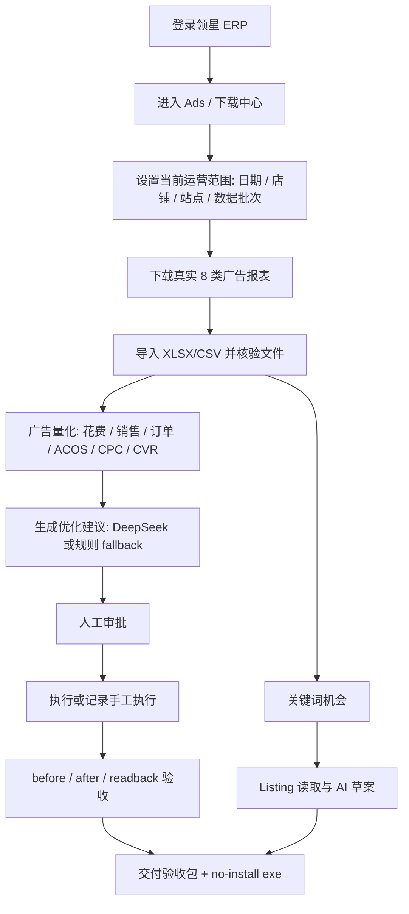

# Amazon AI Ops Final Closeout Implementation Plan

> **For agentic workers:** REQUIRED SUB-SKILL: Use superpowers:subagent-driven-development (recommended) or superpowers:executing-plans to implement this plan task-by-task. Steps use checkbox (`- [ ]`) syntax for tracking.

**Goal:** Finish Amazon AI Ops as a user-testable Windows desktop operations console with clear business UI, real Lingxing ad data gates, ad quantification, recommendation/approval/readback flow, keyword and Listing workflows, final evidence, and a no-install executable.

**Architecture:** Keep the redesigned page-based Electron/React shell. The application is organized around the real Amazon ads operating sequence: collect original Lingxing report files, import and quantify metrics, generate recommendations, approve, record execution/readback, then deliver evidence. Technical diagnostics remain available, but they must not dominate business pages.

**Tech Stack:** Electron, React, TypeScript, Vite, Zustand, better-sqlite3, Python report import helper, Playwright-based smoke scripts, existing Lingxing collector, rules engine, AI adapter, and Windows electron-builder packaging.

---

## Current Confirmed State

### Branch and Worktree

- Working directory: `C:\Users\wz\Desktop\py\amazon-ai-ops`
- Worktree is dirty and contains active implementation changes. Do not revert unrelated edits.
- Main changed areas:
  - `apps/desktop/src/renderer/App.tsx`
  - `apps/desktop/src/renderer/components/*`
  - `apps/desktop/src/renderer/pages/*`
  - `apps/desktop/src/renderer/styles.css`
  - `apps/desktop/src/main/index.ts`
  - `apps/desktop/src/preload/index.ts`
  - `packages/shared-types/src/action.ts`
  - `electron-builder.yml`
  - `scripts/smoke-business-ui-*.js`
  - `scripts/import_lingxing_batch_metrics.py`

### Completed Product/UI Changes

- Old all-in-one `v1.5 工作台` has been split into real business pages:
  - `仪表盘`
  - `数据采集`
  - `广告量化`
  - `优化建议`
  - `审批中心`
  - `执行回读`
  - `关键词机会`
  - `Listing 优化`
  - `定时任务`
  - `设置`
  - `交付验收`
- Global operation scope is visible and uses business wording.
- US marketplace money display is USD, not RMB.
- Dashboard, data pipeline, ad execution, keyword/listing, settings, and delivery smoke scripts exist.
- Recommendation, keyword, and listing flows are batch-aware and scope-aware.
- Settings page includes DeepSeek/OpenAI-compatible config, thresholds, storage, and safety policy.
- Delivery page keeps readiness manifest-driven and does not claim `APP_READY` unless evidence passes.
- `electron-builder.yml` includes a portable target.

### Current Build Artifact

- Portable no-install executable already exists:
  - `apps\desktop\release\AmazonAIOpsAgent-1.5.0-portable.exe`
  - SHA-256 currently recorded as `27A41C520E4813DD15C5DBA53AA71610B33BB312E346325269838A62260DAECA`
- Installer also exists:
  - `apps\desktop\release\AmazonAIOpsAgent-1.5.0.exe`
  - SHA-256 currently recorded as `D21816ABCBE2FB292043DFBB8E4D024221156A42F2A6141DE36F5EF678386FB7`

Hashes must be recalculated if packaging is run again.

### Current Validation Evidence

Targeted checks already passed during the latest implementation slices:

```powershell
pnpm -r run typecheck
node scripts\smoke-business-ui-shell.js
node scripts\smoke-business-ui-data-pipeline.js
node scripts\smoke-business-ui-ad-execution.js
node scripts\smoke-business-ui-keyword-listing.js
node scripts\smoke-business-ui-settings-delivery.js
pnpm --filter @amazon-ai-ops/desktop run build:win
git diff --check
```

Important note: final `pnpm test` was blocked once by `better-sqlite3` Node/Electron ABI mismatch. The native module was manually rebuilt for Node ABI 137 and targeted local-db tests passed afterward. Final full test still needs to be rerun from the current state.

---

## Non-Negotiable Delivery Rules

1. **No fake data readiness**
   - `.json`, `.png`, `.html`, `manifest.json`, and audit files are not ad reports.
   - Only `.xlsx`, `.xls`, and `.csv` Lingxing report files count as real report files.

2. **No decision without imported metrics**
   - Ad quantification, recommendations, approval, keyword opportunities, and delivery readiness must be blocked if the current scope lacks original report files or imported DB metrics.

3. **No RMB**
   - User-facing US marketplace pages must show USD formatting only.

4. **One page, one job**
   - Data collection does not show AI conclusions.
   - Recommendations do not show readback command walls.
   - Readback does not look like a raw audit form.
   - Delivery summarizes final evidence only.

5. **No false `APP_READY`**
   - `APP_READY` can only be shown when final readiness manifest passes.
   - Otherwise top-level status remains `APP_NEEDS_WORK` or equivalent non-ready wording.

6. **Stitch truthfulness**
   - Stitch config may exist, but this session currently does not expose a callable Stitch tool.
   - Do not claim Stitch-generated UI unless a Stitch MCP tool is actually callable and returns artifacts.
   - Until then, implementation uses the documented local design spec plus running-app screenshots.

7. **Incremental tests during iteration**
   - Do not keep running full tests after every small edit.
   - Use targeted smoke/typecheck for each group.
   - Run full tests once at the final acceptance node.

---

## Final User Flow Contract



---

## Phase 1: Final State Audit Before More Edits

**Purpose:** Establish exact current state before touching code again.

**Files:**
- Read: `apps/desktop/src/renderer/App.tsx`
- Read: `apps/desktop/src/renderer/pages/*`
- Read: `apps/desktop/src/main/index.ts`
- Read: `apps/desktop/src/preload/index.ts`
- Read: `electron-builder.yml`
- Read: `scripts/smoke-business-ui-*.js`

- [ ] **Step 1: Capture git state**

Run:

```powershell
git status --short --branch
```

Expected:

```text
Current branch and dirty files are known. No unrelated files are reverted.
```

- [ ] **Step 2: Capture current build artifact hashes**

Run:

```powershell
Get-FileHash apps\desktop\release\AmazonAIOpsAgent-1.5.0-portable.exe -Algorithm SHA256
Get-FileHash apps\desktop\release\AmazonAIOpsAgent-1.5.0.exe -Algorithm SHA256
```

Expected:

```text
Portable and installer hashes are recorded before any rebuild.
```

- [ ] **Step 3: Search for user-facing violations**

Run:

```powershell
rg -n "¥|APP_READY|v1\.5 工作台|V15Workspace|下载已创建的已选报表|正在从领星下载已创建" apps\desktop\src\renderer apps\desktop\src\main apps\desktop\src\preload
```

Expected:

```text
Any remaining hits are classified as active UI, test fixture, or dead legacy code.
Active UI hits are fixed before final packaging.
```

- [ ] **Step 4: Confirm Stitch availability honestly**

Run tool discovery for `stitch`.

Expected:

```text
If no Stitch tool is exposed, final report says Stitch config exists but tool is not callable in this Codex session.
If Stitch tool is exposed, generate design references before final UI polish.
```

---

## Phase 2: Data Collection Truth Fix

**Purpose:** Resolve the user's core concern: the app must not say it downloaded real Lingxing ad data when the folder only contains audit files.

**Files:**
- Modify: `apps/desktop/src/renderer/pages/data-collection-page.tsx`
- Modify: `apps/desktop/src/main/index.ts`
- Modify: `apps/desktop/src/preload/index.ts`
- Modify only if needed: `scripts/smoke-business-ui-data-pipeline.js`

- [ ] **Step 1: Separate Lingxing remote task state from local file state**

UI states must be distinct:

```text
领星任务已创建，等待下载
本地已下载真实报表
本地只有诊断/审计文件
已导入广告指标
```

- [ ] **Step 2: Rename ambiguous buttons**

Use only behavior-accurate labels:

```text
查找并下载已创建报表
重新创建并下载报表
打开本地报表文件夹
导入当前真实报表
导出验收审计
```

If backend cannot truly download existing Lingxing rows, do not show `下载已创建报表`; show `重新创建并下载报表`.

- [ ] **Step 3: Add original report file table**

Table columns:

```text
报表类型
文件名
扩展名
文件大小
导入行数
更新时间
状态
操作
```

Operations:

```text
打开文件
打开文件夹
重新下载
```

- [ ] **Step 4: Enforce backend original-file check**

The backend must only count files matching:

```ts
/\.(xlsx|xls|csv)$/i
```

Files must also exist on disk:

```ts
fs.existsSync(filePath)
```

- [ ] **Step 5: Make false-positive state explicit**

If a batch has audit files but zero report files, show:

```text
当前文件夹只有诊断/审计文件，没有真实广告报表。系统不能进行广告量化。
```

- [ ] **Step 6: Targeted validation**

Run:

```powershell
pnpm --filter @amazon-ai-ops/desktop run typecheck
node scripts\smoke-business-ui-data-pipeline.js
```

Expected:

```text
Smoke confirms audit-only folders do not count as downloaded ad data.
```

---

## Phase 3: UI Clarity and Visual Polish Pass

**Purpose:** Address the current visual complaint: clutter, unclear next action, overloaded cards, and ugly control surfaces.

**Files:**
- Modify: `apps/desktop/src/renderer/styles.css`
- Modify: `apps/desktop/src/renderer/components/app-shell.tsx`
- Modify: `apps/desktop/src/renderer/components/scope-bar.tsx`
- Modify: all `apps/desktop/src/renderer/pages/*`

- [ ] **Step 1: Apply consistent page layout**

Every page uses this structure:

```text
Page header: page purpose + primary task
Scope band: current date/store/site/currency/data batch
Primary work area: only the current page job
Evidence/detail area: secondary, collapsed or visually lower priority
```

- [ ] **Step 2: Reduce information density**

Rules:

```text
No command wall in first viewport.
No nested cards inside large cards unless it is a repeated list.
No more than one primary blue action per task block.
No debug language in business titles.
```

- [ ] **Step 3: Make dashboard operational**

Dashboard first viewport must show:

```text
当前范围是否有真实数据
今日广告状态判断
下一步主操作
关键 KPI: Spend, Sales, Orders, ACOS, CPC, CVR
当前阻断原因
```

- [ ] **Step 4: Make global scope understandable**

Replace vague `全局工作范围` copy with:

```text
当前运营范围
本范围会影响：数据采集、广告量化、优化建议、审批回读、关键词机会、Listing 草案
```

Show `数据批次` as supporting data, not as a headline.

- [ ] **Step 5: Move technical details into disclosure sections**

Collapsed sections:

```text
技术诊断
验收证据
命令与调试
原始 JSON
```

- [ ] **Step 6: Targeted validation**

Run:

```powershell
pnpm --filter @amazon-ai-ops/desktop run typecheck
node scripts\smoke-business-ui-shell.js
node scripts\smoke-business-ui-settings-delivery.js
```

Expected:

```text
Screenshots show readable first viewport and no all-in-one workbench.
```

---

## Phase 4: Ad Quantification Completeness

**Purpose:** Make the system's core value explicit: quantify ad performance before any adjustment.

**Files:**
- Modify: `apps/desktop/src/renderer/pages/ad-quant-page.tsx`
- Modify: `apps/desktop/src/renderer/components/business-data.tsx`
- Modify: `apps/desktop/src/main/index.ts`
- Modify if needed: `packages/local-db/src/sqlite/repositories/ad-metrics-repo.ts`
- Modify if needed: `packages/rules-engine/src/recommendation.ts`

- [ ] **Step 1: Show canonical totals**

Summary cards:

```text
Spend
Sales
Orders
ACOS
CPC
CVR
Waste Spend
High-risk entities
```

- [ ] **Step 2: Explain metric口径**

Show:

```text
总览优先使用 search term / user search term 口径，避免 8 报表重复粒度叠加。
```

- [ ] **Step 3: Show entity-level table**

Columns:

```text
广告组合
广告活动
广告组
ASIN/产品
对象类型
关键词/搜索词/投放对象
Spend
Sales
Orders
Clicks
ACOS
CPC
CVR
诊断
建议方向
```

- [ ] **Step 4: Show thresholds**

Current thresholds visible on page:

```text
目标 ACOS
高 ACOS
无订单点击
最低花费
最大降价比例
品牌/核心词保护
```

- [ ] **Step 5: Targeted validation**

Run:

```powershell
pnpm --filter @amazon-ai-ops/desktop run typecheck
node scripts\smoke-business-ui-data-pipeline.js
```

Expected:

```text
Ad quant screenshot shows USD, canonical totals, thresholds, and entity context.
```

---

## Phase 5: Recommendation, Approval, and Readback Hardening

**Purpose:** Keep thinking, deciding, and proving separate, while supporting many ads/products instead of one sample.

**Files:**
- Modify: `apps/desktop/src/renderer/pages/recommendations-page.tsx`
- Modify: `apps/desktop/src/renderer/pages/approval-page.tsx`
- Modify: `apps/desktop/src/renderer/pages/readback-page.tsx`
- Modify: `apps/desktop/src/main/index.ts`
- Modify: `apps/desktop/src/preload/index.ts`
- Modify: `packages/shared-types/src/action.ts`
- Modify: `scripts/smoke-business-ui-ad-execution.js`

- [ ] **Step 1: Recommendation details must include source**

Every recommendation detail shows:

```text
Portfolio
Campaign
Ad group
ASIN/product
Keyword/search term/target
Current value
Recommended value
Spend/orders/clicks/ACOS
Source file
Data batch
Rule threshold
AI explanation source
```

- [ ] **Step 2: Approval supports multiple entities**

Required approval fields:

```text
Store
Site
Campaign
Ad group
Entity type
Entity name
Action type
Approver
Approval scope
Approval artifact path
```

- [ ] **Step 3: Readback supports generic actions**

Required readback fields:

```text
Before value
Before screenshot/evidence
After value
After screenshot/evidence
Readback actual value
Readback evidence path
Operator
Execution time
```

- [ ] **Step 4: Keep live writes fail-closed**

Live or manual execution can only be accepted when all are present:

```text
Approved recommendation
Low-risk policy allowed
Explicit operator confirmation
Before evidence
After evidence
Readback actual value
Scope match
```

- [ ] **Step 5: Targeted validation**

Run:

```powershell
pnpm --filter @amazon-ai-ops/desktop run typecheck
node scripts\smoke-business-ui-ad-execution.js
```

Expected:

```text
Smoke confirms recommendation -> approval -> readback pages are separated and scope-bound.
```

---

## Phase 6: Keyword and Listing Final Polish

**Purpose:** Ensure keyword and Listing pages preserve context and are usable after ad quantification.

**Files:**
- Modify: `apps/desktop/src/renderer/pages/keyword-opportunities-page.tsx`
- Modify: `apps/desktop/src/renderer/pages/listing-optimization-page.tsx`
- Modify if needed: `apps/desktop/src/main/listing-lingxing-extractor.ts`
- Modify: `scripts/smoke-business-ui-keyword-listing.js`

- [ ] **Step 1: Keyword opportunities table remains context-rich**

Columns:

```text
ASIN
Portfolio
Campaign
Ad group
Keyword/search term/target
Coverage
Clicks/orders
Spend/sales
ACOS
Opportunity level
Recommended placement
Risk
```

- [ ] **Step 2: No vague `source` main column**

Source details only in row detail:

```text
Original report file
Report type
Imported row count
Data batch
```

- [ ] **Step 3: Listing read evidence is explicit**

Show:

```text
ASIN matched
Title read
Bullets read
Description read
Backend terms read
Page URL
Screenshot/evidence path
```

- [ ] **Step 4: Listing AI draft is clearly local-only**

Always show:

```text
草案只保存在本地，不会自动提交 Amazon。
```

- [ ] **Step 5: Targeted validation**

Run:

```powershell
pnpm --filter @amazon-ai-ops/desktop run typecheck
node scripts\smoke-business-ui-keyword-listing.js
```

Expected:

```text
Smoke confirms keyword/listing pages are scope-aware and not mixed with data collection/readback UI.
```

---

## Phase 7: Real Lingxing Data Evidence

**Purpose:** Prove the app runs on actual Lingxing ad report spreadsheets.

**Files/Outputs:**
- Input/output: Lingxing download center through app profile
- Output: `storage\downloads\lingxing-ad-reports\...`
- Output: `output\codex-evidence\...`
- Output: `storage\exports\lingxing_acceptance_audit_...`
- DB: `C:\Users\wz\AmazonAIOps\app-data\amazon-ai-ops.db`

- [ ] **Step 1: Use app login flow**

Flow:

```text
Open app -> Login ERP -> Enter Ads/download center -> Verify page -> Download/import reports
```

Do not start by opening Ads directly.

- [ ] **Step 2: Download real report files**

Expected local files:

```text
At least one current-scope .xlsx/.xls/.csv report file.
Preferably all 8 report types if Lingxing page supports it.
```

- [ ] **Step 3: Verify file presence**

Run:

```powershell
Get-ChildItem -Recurse "$env:APPDATA\@amazon-ai-ops\desktop\storage\downloads\lingxing-ad-reports" -Include *.xlsx,*.xls,*.csv | Select-Object FullName,Length,LastWriteTime
```

Expected:

```text
Real spreadsheet files are visible with non-zero file sizes.
```

- [ ] **Step 4: Verify DB import**

Run:

```powershell
@'
import sqlite3, json
path = r'C:\Users\wz\AmazonAIOps\app-data\amazon-ai-ops.db'
conn = sqlite3.connect(f'file:{path}?mode=ro', uri=True)
cur = conn.cursor()
rows = cur.execute("""
SELECT batch_id, report_type, COUNT(*) rows, ROUND(SUM(cost), 2) spend, SUM(orders) orders
FROM ad_daily_metrics
GROUP BY batch_id, report_type
ORDER BY batch_id DESC, report_type
LIMIT 50
""").fetchall()
print(json.dumps(rows, ensure_ascii=False, indent=2))
conn.close()
'@ | python -
```

Expected:

```text
Current batch has imported rows and realistic spend/order totals.
```

- [ ] **Step 5: Reconcile totals**

Compare:

```text
Original report spreadsheet totals
DB aggregation totals
App UI totals
```

Expected:

```text
Differences are zero or explainable by canonical口径 selection.
```

- [ ] **Step 6: Export acceptance audit**

Expected:

```text
Audit bundle includes original report files, manifest, DB consistency, UI screenshot, and any missing blockers.
```

---

## Phase 8: Final Tests and Packaging

**Purpose:** Produce the final no-install executable for user validation.

**Files/Outputs:**
- `apps\desktop\release\AmazonAIOpsAgent-1.5.0-portable.exe`
- `apps\desktop\release\AmazonAIOpsAgent-1.5.0.exe`
- `output\codex-evidence\final-*.json`
- Final screenshot evidence

- [ ] **Step 1: Full typecheck**

Run:

```powershell
pnpm -r run typecheck
```

Expected:

```text
All packages pass typecheck.
```

- [ ] **Step 2: Full tests**

Run:

```powershell
pnpm test
```

If `better-sqlite3` ABI fails again, rebuild for Node ABI 137 and rerun:

```powershell
pnpm rebuild better-sqlite3
pnpm test
```

Expected:

```text
Full test suite passes.
```

- [ ] **Step 3: Final business UI smoke set**

Run:

```powershell
node scripts\smoke-business-ui-shell.js
node scripts\smoke-business-ui-data-pipeline.js
node scripts\smoke-business-ui-ad-execution.js
node scripts\smoke-business-ui-keyword-listing.js
node scripts\smoke-business-ui-settings-delivery.js
```

Expected:

```text
Each script writes JSON evidence and screenshots. Screenshots show the rebuilt page-based UI.
```

- [ ] **Step 4: Build Windows artifacts**

Run:

```powershell
pnpm --filter @amazon-ai-ops/desktop run build:win
```

Expected:

```text
Portable and installer artifacts exist under apps\desktop\release.
```

- [ ] **Step 5: Recalculate hashes**

Run:

```powershell
Get-FileHash apps\desktop\release\AmazonAIOpsAgent-1.5.0-portable.exe -Algorithm SHA256
Get-FileHash apps\desktop\release\AmazonAIOpsAgent-1.5.0.exe -Algorithm SHA256
```

Expected:

```text
Final hashes are included in the delivery report.
```

---

## Phase 9: Subagent Review and Final Report

**Purpose:** Preserve the requested subagent-driven process and avoid self-certifying weak evidence.

**Subagents:**
- `UI/UX reviewer`
- `Data integrity reviewer`
- `Delivery QA reviewer`

- [ ] **Step 1: UI/UX review**

Review against:

```text
Menu split
One page one job
Readable first viewport
USD only
No debug-first screens
Clear next action
```

- [ ] **Step 2: Data integrity review**

Review against:

```text
Original report files exist
Audit files are not counted
DB imports match current batch
Canonical totals are not inflated by duplicate report grains
```

- [ ] **Step 3: Delivery QA review**

Review against:

```text
Typecheck passed
Full tests passed
Smoke screenshots exist
Portable exe exists
Installer exists
Hashes recorded
APP_READY is not falsely claimed
```

- [ ] **Step 4: Final user report**

Final report must include:

```text
Current status: READY or NEEDS_WORK
Portable exe path
Installer path
SHA-256 hashes
What changed in UI
Which evidence files/screenshots were generated
Real Lingxing data status
DB totals status
DeepSeek status
Remaining blockers
Recommended user validation steps
```

---

## Stop Conditions

Stop and report immediately if any of these occurs:

- Lingxing login fails.
- Ads/download center cannot be reached through the app login flow.
- UI claims downloaded reports but local folder has no `.xlsx`, `.xls`, or `.csv`.
- DB totals cannot be tied to the selected data batch.
- App shows RMB on user-facing US pages.
- Final manifest fails while UI says `APP_READY`.
- Stitch output is requested but no callable Stitch tool exists.
- Rebuilding breaks native dependencies and full tests cannot be restored.

---

## Definition of Done

- User-facing UI is page-based and follows the real business flow.
- Data collection proves real Lingxing report spreadsheets exist.
- Ad quantification uses imported real metrics and USD.
- Recommendations show portfolio/campaign/ad group/product/entity context plus current/recommended values.
- Approval and readback support generic multi-object actions.
- Keyword opportunities are deduped and context-rich.
- Listing optimization reads or imports Listing content and produces local-only AI/fallback drafts.
- Delivery page is evidence-driven and does not falsely claim readiness.
- Full typecheck, full tests, smoke screenshots, Windows build, and final hashes are complete.
- User receives a no-install `.exe` for validation.
