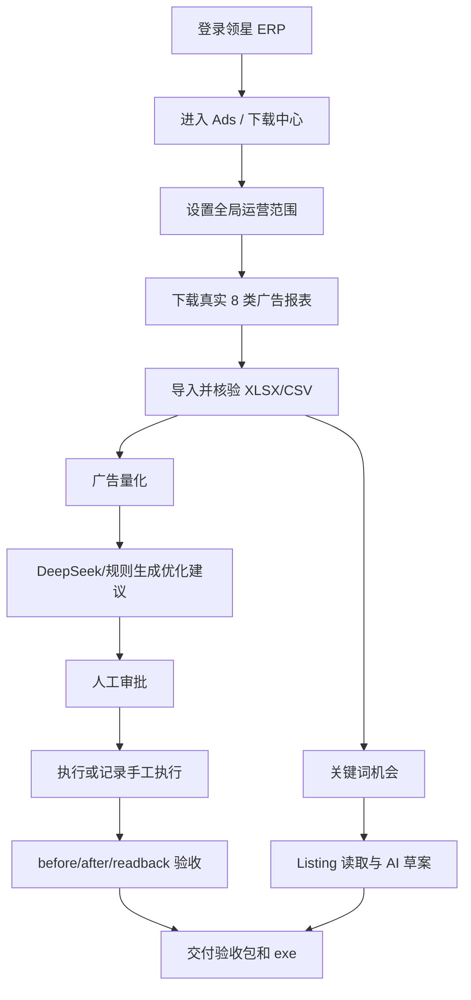

# Amazon AI Ops Finish Plan

> **For agentic workers:** REQUIRED SUB-SKILL: Use superpowers:subagent-driven-development or superpowers:executing-plans. This plan starts from the current `codex/business-ui-redesign` branch state and is optimized for finishing, verification, and a user-testable no-install Windows executable.

**Goal:** Finish the Amazon AI Ops desktop app as a real business operations console: original Lingxing ad report files first, then ad quantification, recommendations, approval/readback, keyword and Listing workflows, final delivery evidence, and a no-install `.exe`.

**Architecture:** Keep the redesigned shell and global operation scope. Each sidebar page owns one business job only. Technical audit/debug output is still available, but it is not the main interface. Any downstream AI, quantification, recommendation, approval, or readback operation is gated by real original `.xlsx/.xls/.csv` Lingxing report files and imported DB metrics.

**Validation Policy:** During iteration run only targeted typecheck/build/smoke checks for the changed group. Run full repo tests and Windows build only at the final delivery node.

---

## Current Branch State

- Branch: `codex/business-ui-redesign`
- Main renderer rewrite is underway.
- Already implemented:
  - New sidebar information architecture.
  - Global operation scope bar.
  - USD formatters.
  - Dashboard/data collection/ad quantification pages.
  - Recommendation/approval/readback page split.
  - Real-data gates in main process for recommendation generation and approval.
  - Smoke scripts for shell, data pipeline, and ad execution.
- In progress:
  - Keyword opportunities page.
  - Listing optimization page.
- Still pending:
  - Settings page polish.
  - Delivery center polish.
  - Full UI visual pass against the business design direction.
  - Real Lingxing file evidence run.
  - Final full tests/build/hash/no-install exe.

## Non-Negotiable Product Rules

1. **Currency:** US marketplace displays USD only. No `¥` on user-facing business pages.
2. **Data source:** Real Lingxing report files are `.xlsx`, `.xls`, or `.csv`. Audit JSON/PNG/HTML files never count as ad data.
3. **No data, no decision:** If the current scope has no original report files or no imported ad metrics, block quantification, recommendations, approval, readback, keyword opportunities, and delivery-ready claims.
4. **Scope clarity:** Every business page must show the current operation scope: date range, store, site, currency, and data batch status.
5. **One page, one job:** No all-in-one `v1.5 工作台`. No business page should mix data collection, AI recommendations, readback forms, and audit commands together.
6. **Execution safety:** The app can support one approved paused-ad sample for evidence, but the UI/data model must handle many products, campaigns, ad groups, keywords, targets, and stores.
7. **Stitch:** Stitch is configured in MCP config but not exposed as a callable tool in this session. Do not claim a Stitch-generated design unless a callable Stitch tool is available and returns artifacts.

## Final Menu Contract

- **运营总览**
  - `仪表盘`
- **数据与量化**
  - `数据采集`
  - `广告量化`
- **广告执行**
  - `优化建议`
  - `审批中心`
  - `执行回读`
- **关键词与 Listing**
  - `关键词机会`
  - `Listing 优化`
- **系统与交付**
  - `定时任务`
  - `设置`
  - `交付验收`

## Target User Flow



---

## Phase 1: Freeze Current Renderer Shell Contract

**Purpose:** Ensure all pages use the new navigation, scope bar, and USD display rules before adding more business logic.

**Files:**
- `apps/desktop/src/renderer/App.tsx`
- `apps/desktop/src/renderer/components/app-shell.tsx`
- `apps/desktop/src/renderer/components/scope-bar.tsx`
- `apps/desktop/src/renderer/styles.css`
- `apps/desktop/src/renderer/formatters.ts`
- `scripts/smoke-business-ui-shell.js`

**Tasks:**
- [x] Keep new menu groups and remove the old `v1.5 工作台` from the active route set.
- [x] Keep `APP_NEEDS_WORK` until the final readiness manifest passes.
- [x] Use `formatUsd()` for all money values in active pages.
- [ ] Remove or isolate old dead renderer code that still contains `APP_READY`, `¥`, old command blocks, or `V15Workspace` labels, so audit searches do not produce false positives.
- [ ] Add a smoke assertion that active pages do not render `v1.5 工作台`, `APP_READY`, or RMB symbols.

**Incremental checks only:**

```powershell
pnpm --filter @amazon-ai-ops/desktop run typecheck
pnpm --filter @amazon-ai-ops/desktop run build:renderer
node scripts/smoke-business-ui-shell.js
```

**Exit criteria:**
- Sidebar matches the final menu contract.
- Scope bar is visible on business pages.
- No active user-facing page renders RMB or `APP_READY`.

---

## Phase 2: Complete Real Data Collection Contract

**Purpose:** Fix the core product problem: the app must prove it has real Lingxing ad report files before claiming data collection success.

**Files:**
- `apps/desktop/src/renderer/pages/data-collection-page.tsx`
- `apps/desktop/src/main/index.ts`
- `apps/desktop/src/preload/index.ts`
- `packages/lingxing-report-collector/src/*`
- `scripts/smoke-business-ui-data-pipeline.js`

**Tasks:**
- [x] Keep buttons semantically honest:
  - `创建/重试并下载已选报表`
  - `完整创建并下载 8 类报表`
- [x] Backend must accept only existing `.xlsx/.xls/.csv` files as report data.
- [x] Backend must reject batch/scope mismatch instead of leaking old batch data into current scope.
- [x] Data collection page must show real file count and imported row count.
- [ ] Add an explicit original-file table:
  - Report name
  - File name
  - File type
  - Size
  - Imported rows
  - Last modified
  - Open file
  - Open folder
- [ ] If Lingxing says “already created” but files are not locally downloaded, show a clear state:
  - `领星任务已存在，本地尚未下载原始报表`
  - Primary action: `从下载中心下载已创建报表`
- [ ] If the current implementation cannot truly download existing rows without creating a new task, label the button honestly:
  - `重新创建并下载`
  - Do not present it as `下载已创建`.

**Incremental checks only:**

```powershell
pnpm --filter @amazon-ai-ops/desktop run typecheck
pnpm --filter @amazon-ai-ops/desktop run build:renderer
node scripts/smoke-business-ui-data-pipeline.js
```

**Exit criteria:**
- A folder containing only JSON/PNG/HTML audit files is shown as `无真实广告报表`.
- A folder containing real XLSX/CSV files is shown with exact file paths and import counts.
- Quantification and recommendation buttons stay disabled until imported metrics exist.

---

## Phase 3: Finish Ad Quantification as the Business Center

**Purpose:** Make “广告量化” the place where the operator understands performance before any adjustment.

**Files:**
- `apps/desktop/src/renderer/pages/ad-quant-page.tsx`
- `apps/desktop/src/renderer/components/business-data.tsx`
- `apps/desktop/src/main/index.ts`
- `packages/local-db/src/sqlite/repositories/ad-metrics-repo.ts`
- `packages/rules-engine/src/recommendation.ts`

**Tasks:**
- [x] Query only executable ad grains: keyword, search term, product targeting, auto targeting.
- [x] Require real source files for metric source.
- [ ] Show quant summary cards:
  - Spend
  - Sales
  - Orders
  - ACOS
  - Clicks
  - CPC
  - CVR
  - Wasted spend
- [ ] Show entity-level table with context:
  - Portfolio
  - Campaign
  - Ad group
  - ASIN/product
  - Keyword/search term/target
  - Spend/sales/orders/clicks
  - ACOS/CPC/CVR
  - Diagnosis
  - Suggested direction
- [ ] Add threshold summary from settings:
  - Target ACOS
  - High ACOS threshold
  - No-order click threshold
  - Min spend threshold
- [ ] Empty state must say exactly what is missing:
  - Original report files missing
  - Imported DB metrics missing
  - Scope mismatch

**Incremental checks only:**

```powershell
pnpm --filter @amazon-ai-ops/desktop run typecheck
node scripts/smoke-business-ui-data-pipeline.js
```

**Exit criteria:**
- Operator can see why a campaign/ad group/keyword is healthy, wasteful, scalable, or blocked.
- No recommendations are generated directly from this page without passing the recommendation gate.

---

## Phase 4: Complete Recommendation, Approval, and Readback Flow

**Purpose:** Separate thinking, deciding, and proving. The user should not see a giant technical readback form as the main experience.

**Files:**
- `apps/desktop/src/renderer/pages/recommendations-page.tsx`
- `apps/desktop/src/renderer/pages/approval-page.tsx`
- `apps/desktop/src/renderer/pages/readback-page.tsx`
- `apps/desktop/src/main/index.ts`
- `apps/desktop/src/preload/index.ts`
- `packages/shared-types/src/action.ts`
- `scripts/smoke-business-ui-ad-execution.js`

**Tasks:**
- [x] Recommendation generation requires full scope and a real data gate.
- [x] Generated recommendation evidence includes `batchId` and `sourceFiles`.
- [x] Recommendations page does not include execution/readback controls.
- [x] Approval page is separated from recommendation generation.
- [x] Readback page is separated from approval.
- [x] Recommendation detail drawer/card must show:
  - Current value
  - Recommended value
  - Source file(s)
  - Batch
  - ACOS/spend/orders/clicks evidence
  - Rule threshold used
  - AI explanation source
- [x] Approval page must support multi-object decisions:
  - Campaign
  - Ad group
  - Entity type
  - Entity name
  - Action type
  - Approver
  - Approval scope
- [x] Readback page must support generic action records, not only one paused ad sample.
- [x] Hide CLI command blocks behind `技术细节`; do not show them as the main workflow.

**Incremental checks only:**

```powershell
pnpm --filter @amazon-ai-ops/desktop run typecheck
pnpm --filter @amazon-ai-ops/desktop run build:renderer
node scripts/smoke-business-ui-ad-execution.js
```

**Exit criteria:**
- A user can go from recommendation to approval to readback with clear state transitions.
- The app refuses approval if the recommendation is not tied to current real data.

---

## Phase 5: Finish Keyword Opportunities

**Status:** Completed for the current redesign slice on 2026-06-12. Targeted checks passed:

```powershell
pnpm --filter @amazon-ai-ops/desktop run typecheck
pnpm --filter @amazon-ai-ops/desktop run build:renderer
node scripts/smoke-business-ui-keyword-listing.js
```

Evidence:

```text
output/codex-evidence/business-ui-keyword-listing-smoke-1781267756011.json
output/codex-evidence/business-ui-keyword-listing-keywords-1781267756011.png
```

**Purpose:** Produce usable keyword opportunities with full advertising context, not a vague source list.

**Files:**
- `apps/desktop/src/renderer/pages/keyword-opportunities-page.tsx`
- `apps/desktop/src/main/index.ts`
- `apps/desktop/src/preload/index.ts`
- `apps/desktop/src/renderer/types.ts`
- `scripts/smoke-business-ui-keyword-listing.js`

**Tasks:**
- [x] Add backend IPC `v1_5:business-ui:keyword-opportunities`.
- [x] Gate keyword opportunities by real current scope data.
- [x] Deduplicate by business identity:
  - Store
  - Site
  - ASIN
  - Campaign
  - Ad group
  - Entity type
  - Keyword/search term/target
- [x] Main table columns:
  - ASIN
  - Portfolio
  - Campaign
  - Ad group
  - Keyword/search term/target
  - Coverage status
  - Clicks/orders
  - Spend/sales
  - ACOS
  - Opportunity level
  - Recommended placement
  - Risk
- [x] Add row detail for source file, report type, and import evidence.
- [x] Add filter controls:
  - ASIN
  - Campaign
  - Coverage status
  - Minimum clicks
  - Minimum spend
  - Opportunity level
- [x] Add handoff from keyword row to Listing optimization:
  - Pass selected ASIN and keyword list into Listing page state.
- [x] Fail closed when current scope lacks real report files/imported metrics.
- [x] Guard Listing handoff by current scope and ASIN to avoid stale cross-ASIN keyword reuse.

**Incremental checks only:**

```powershell
pnpm --filter @amazon-ai-ops/desktop run typecheck
pnpm --filter @amazon-ai-ops/desktop run build:renderer
node scripts/smoke-business-ui-keyword-listing.js
```

**Exit criteria:**
- Keyword opportunities are not merged into ambiguous rows.
- Every opportunity preserves campaign/ad group/product context.

---

## Phase 6: Finish Listing Optimization

**Status:** Completed for the current redesign slice on 2026-06-12. Targeted checks passed:

```powershell
pnpm --filter @amazon-ai-ops/desktop run typecheck
pnpm --filter @amazon-ai-ops/desktop run build:renderer
node scripts/smoke-business-ui-keyword-listing.js
```

Evidence:

```text
output/codex-evidence/business-ui-keyword-listing-smoke-1781267756011.json
output/codex-evidence/business-ui-keyword-listing-listing-1781267756011.png
```

**Purpose:** Make Listing optimization a readable workflow: read Listing, check keyword coverage, generate AI draft, export draft.

**Files:**
- `apps/desktop/src/renderer/pages/listing-optimization-page.tsx`
- `apps/desktop/src/main/listing-lingxing-extractor.ts`
- `apps/desktop/src/main/index.ts`
- `apps/desktop/src/preload/index.ts`
- `scripts/smoke-business-ui-keyword-listing.js`

**Tasks:**
- [x] Add Listing page skeleton with:
  - Listing source
  - Current content
  - Keyword coverage
  - AI suggestions
  - Export
- [x] Validate renderer type correctness.
- [x] Display Lingxing read evidence:
  - ASIN matched
  - Title read
  - Bullets read
  - Description read
  - Backend terms read
  - Page URL
  - Screenshot path if available
- [x] AI draft output must show:
  - Section
  - Current text
  - Draft text
  - Keywords used
  - Source: AI or fallback rule
  - Reason
  - Risk
- [x] Page must always say:
  - `草案只保存在本地，不会自动提交 Amazon`
- [x] If DeepSeek key is missing, show rule fallback, not fake AI.
- [x] Fail closed when Lingxing read API/result/content is missing or blocked; do not generate drafts from empty Listing content.
- [x] Consume and clear keyword handoff safely, with scope/ASIN mismatch guard.

**Incremental checks only:**

```powershell
pnpm --filter @amazon-ai-ops/desktop run typecheck
pnpm --filter @amazon-ai-ops/desktop run build:renderer
node scripts/smoke-business-ui-keyword-listing.js
```

**Exit criteria:**
- User can see what was read from Lingxing and what AI changed.
- Listing page is not mixed with ad collection or readback audit UI.

---

## Phase 7: Settings and Safety Controls

**Status:** Completed for Group 5 Settings on 2026-06-12. Targeted Settings/Delivery checks passed:

```powershell
pnpm --filter @amazon-ai-ops/desktop run typecheck
pnpm --filter @amazon-ai-ops/desktop run build:renderer
node scripts/smoke-business-ui-settings-delivery.js
```

Evidence:

```text
output/codex-evidence/business-ui-settings-delivery-smoke-1781271599273.json
output/codex-evidence/business-ui-settings-delivery-settings-1781271599273.png
```

**Purpose:** Put configuration in one place and make AI/rule/safety status visible.

**Files:**
- `apps/desktop/src/renderer/pages/settings-page.tsx`
- `apps/desktop/src/main/index.ts`
- `apps/desktop/src/preload/index.ts`
- `packages/ai-adapter/src/*`
- `packages/rules-engine/src/*`

**Tasks:**
- [x] Split settings into sections:
  - DeepSeek / OpenAI-compatible AI
  - Ad quantification thresholds
  - Safety policy
  - Storage paths
  - Diagnostics
- [x] Add AI connection test:
  - Base URL
  - Model
  - Key present/missing
  - Test result
  - Last checked time
- [x] Mask API keys:
  - Never show the full key.
  - Never store the key in delivery packages.
- [x] Threshold UI fields:
  - Target ACOS
  - High ACOS threshold
  - No-order click threshold
  - Minimum spend
  - Bid adjustment percentage
  - Maximum decrement percentage
  - Brand/core whitelist
- [x] Safety policy UI:
  - No unbounded batch write
  - Require approval
  - Require before/after/readback
  - Require scope match

**Incremental checks only:**

```powershell
pnpm --filter @amazon-ai-ops/desktop run typecheck
pnpm --filter @amazon-ai-ops/desktop run build:renderer
```

**Exit criteria:**
- User can understand whether AI is live, fallback, or unavailable.
- Rule thresholds are configurable and reflected in quantification/recommendation pages.

---

## Phase 8: Delivery Center

**Status:** Completed for Group 5 Delivery P0 on 2026-06-12. Targeted Settings/Delivery checks passed:

```powershell
pnpm --filter @amazon-ai-ops/desktop run typecheck
pnpm --filter @amazon-ai-ops/desktop run build:renderer
node scripts/smoke-business-ui-settings-delivery.js
```

Evidence:

```text
output/codex-evidence/business-ui-settings-delivery-smoke-1781271599273.json
output/codex-evidence/business-ui-settings-delivery-settings-1781271599273.png
output/codex-evidence/business-ui-settings-delivery-delivery-1781271599273.png
```

**Purpose:** Turn final readiness into a user-readable delivery page, not an audit dump.

**Files:**
- `apps/desktop/src/renderer/pages/delivery-page.tsx`
- `scripts/verify-v15-final-readiness.js`
- `scripts/export-v15-delivery-bundle.js`
- `docs/V1_5_ACCEPTANCE_MATRIX.md`
- `docs/V1_5_PROGRESS_REPORT.md`

**Tasks:**
- [x] Delivery page sections:
  - App readiness status
  - Real report files
  - Imported metrics
  - Ad quantification
  - DeepSeek/AI evidence
  - Recommendations
  - Approval/readback
  - Keyword opportunities
  - Listing AI draft
  - Installer
- [x] Show missing evidence as actionable items, not raw JSON.
- [x] Keep final readiness manifest as the source of truth.
- [x] Do not display `APP_READY` unless final readiness passes.
- [x] Read final readiness from `output/codex-evidence/final-readiness-*.json` or configured final readiness path only; no Lingxing batch manifest fallback.
- [x] Make export delivery bundle clickable with clear missing-prerequisite responses.
- [x] Add buttons:
  - Export delivery bundle
  - Open evidence folder
  - Open final manifest
  - Copy summary

**Incremental checks only:**

```powershell
pnpm --filter @amazon-ai-ops/desktop run typecheck
pnpm --filter @amazon-ai-ops/desktop run build:renderer
```

**Exit criteria:**
- Delivery page tells the user exactly what is complete, what is blocked, and where evidence lives.

---

## Phase 9: Visual and Interaction Pass

**Purpose:** Fix the user's core UX complaint: clutter, unclear next action, weak dashboard, and ugly control surfaces.

**Files:**
- `apps/desktop/src/renderer/styles.css`
- All files under `apps/desktop/src/renderer/pages/`
- All files under `apps/desktop/src/renderer/components/`
- Smoke scripts under `scripts/smoke-business-ui-*.js`

**Tasks:**
- [x] Split `v1.5 工作台` into real business pages in the sidebar:
  - Dashboard
  - Data collection
  - Ad quantification
  - Recommendations
  - Approval
  - Execution readback
  - Keyword opportunities
  - Listing optimization
  - Scheduler
  - Settings
  - Delivery
- [x] Add a real Scheduler page instead of a placeholder.
- [x] Move technical command walls behind collapsed detail controls on Settings and Readback.
- [x] Add explicit readback export feedback:
  - Export status.
  - Execution scope.
  - JSON and Markdown evidence paths.
  - Clear note that export writes local evidence only and does not submit to Amazon.
- [x] Add dashboard workflow strip for the actual operating sequence:
  - Get real reports.
  - Quantify ads.
  - Generate recommendations.
  - Approve/read back.
- [x] Rename global scope copy to business wording and show USD currency.
- [ ] Continue reducing oversized cards and nested panels where they obscure the main job.
- [ ] Use a consistent page layout:
  - Header: page purpose and primary task.
  - Scope: current range/status.
  - Main work area: only the current page job.
  - Evidence/detail: secondary, collapsed or lower priority.
- [ ] Add meaningful empty states:
  - What is missing.
  - Why it matters.
  - Which button fixes it.
- [ ] Replace vague labels:
  - `批次` -> `数据批次`
  - `源` -> `原始报表 / 导入来源`
  - `验证` -> specify `验证页面`, `验证报表`, `验证回读`
- [ ] Ensure all primary buttons have one clear next action.
- [x] Take screenshots from smoke scripts for:
  - Dashboard
  - Data collection
  - Ad quant
  - Recommendations
  - Approval
  - Readback
  - Keywords
  - Listing
  - Settings
  - Delivery
- [ ] Add visual screenshots for final real Lingxing run once real XLSX/CSV files are present.

**Incremental checks only:**

```powershell
pnpm --filter @amazon-ai-ops/desktop run typecheck
pnpm --filter @amazon-ai-ops/desktop run build:renderer
node scripts/smoke-business-ui-shell.js
node scripts/smoke-business-ui-data-pipeline.js
node scripts/smoke-business-ui-ad-execution.js
node scripts/smoke-business-ui-keyword-listing.js
```

**Exit criteria:**
- A first-time user can identify:
  - Where to get data.
  - Whether data exists.
  - Where to quantify.
  - Where to generate/approve recommendations.
  - Where to check final delivery state.

**Current evidence:**

```text
pnpm --filter @amazon-ai-ops/desktop run typecheck
pnpm --filter @amazon-ai-ops/desktop run build:renderer
node scripts\smoke-business-ui-shell.js
node scripts\smoke-business-ui-settings-delivery.js
node scripts\smoke-business-ui-ad-execution.js

output/codex-evidence/business-ui-shell-smoke-1781272366182.json
output/codex-evidence/business-ui-settings-delivery-smoke-1781272376066.json
output/codex-evidence/business-ui-ad-execution-smoke-1781272571356.json
output/codex-evidence/business-ui-ad-execution-readback-after-export-1781272571356.png
output/codex-evidence/business-ui-data-pipeline-smoke-1781274895152.json
output/codex-evidence/business-ui-data-pipeline-dashboard-after-import-1781274895152.png
output/codex-evidence/business-ui-data-pipeline-ad-quant-after-import-1781274895152.png
```

**Remaining UX risks:**
- Dashboard now has a first-screen "今日运营判断" band; continue validating it against real imported metrics.
- Quantification page now has "主要问题摘要" before the table; continue validating risk scoring against real imported metrics.
- Delivery page should highlight "current blocker" above the full evidence matrix.

---

## Phase 10: Real Lingxing Evidence Run

**Purpose:** Prove the system works against real Lingxing data, not mocks or audit artifacts.

**Files/Outputs:**
- `storage/downloads/lingxing-ad-reports/...`
- `storage/exports/lingxing_acceptance_audit_...`
- `output/codex-evidence/...`
- User DB: `C:\Users\wz\AmazonAIOps\app-data\amazon-ai-ops.db`

**Tasks:**
- [x] Add data-file guardrail before the real Lingxing run:
  - Real ad report files must be existing `.xlsx/.xls/.csv`.
  - Audit JSON, screenshots, DOM/HTML and Manifest are not counted as ad data.
  - Data collection page shows real report count, imported rows, file record count, rejected evidence count, missing report labels, download directory, and manifest path.
  - Auto-matched latest data batch only uses `status = 'completed'`.
- [x] Add explicit import action for already-downloaded current-scope real reports:
  - `v1_5:business-ui:import-current-reports`
  - Renderer button: `导入当前真实报表`
  - The action imports only current completed batch `.xlsx/.xls/.csv` files and refreshes the quantification view.
- [x] Fix ad quant total口径 to avoid 8-report duplicate-grain inflation:
  - Total spend/sales/orders/clicks/impressions prefer `user_search_term/search_term` canonical口径.
  - Executable entity rows remain available for diagnostics.
  - UI shows the total口径 note.
- [ ] Start from app login flow:
  - ERP login first.
  - Then enter Ads/download center.
  - Do not bypass the login flow by opening Ads directly.
- [ ] Validate download center page model.
- [ ] Use a real scope:
  - Date range
  - Store
  - Site
  - Data batch
- [ ] Download real report files.
- [ ] Confirm local folder contains `.xlsx/.xls/.csv`.
- [ ] Confirm imported DB metrics.
- [ ] Reconcile totals:
  - Original file total spend/orders
  - DB total spend/orders
  - App UI total spend/orders
- [ ] Export acceptance audit.

**Current guardrail evidence:**

```text
pnpm --filter @amazon-ai-ops/desktop run typecheck
pnpm --filter @amazon-ai-ops/desktop run build:renderer
node scripts\smoke-business-ui-data-pipeline.js

output/codex-evidence/business-ui-data-pipeline-smoke-1781273010007.json
output/codex-evidence/business-ui-data-pipeline-data-collection-1781273010007.png
output/codex-evidence/business-ui-data-pipeline-smoke-1781274024363.json
output/codex-evidence/business-ui-data-pipeline-data-collection-after-import-1781274024363.png
output/codex-evidence/business-ui-data-pipeline-ad-quant-after-import-1781274024363.png
output/codex-evidence/business-ui-data-pipeline-smoke-1781274460334.json
output/codex-evidence/real-lingxing-import-batch_20260612020905629_gkchz1.json
output/codex-evidence/real-lingxing-reconciliation-batch_20260612020905629_gkchz1.json
```

**Current real DB finding:**
- Scope: `2026-06-01` to `2026-06-12` / `FT-US-US` / `US` / `USD`
- Batch: `batch_20260612020905629_gkchz1`
- Real files: 8 `.xlsx`
- Imported rows: 2416
- All 8 reports naive sum: spend `3745.38`, orders `114` (not a valid total口径)
- Canonical search-term total: spend `617.87`, orders `19`
- Executable reports naive sum: spend `1242.37`, orders `38` (duplicated targeting/search-term detail)
- Code review re-review: PASS after strict `batch_id = ?` source-file binding, preventing legacy empty-batch duplicate counts.

**Evidence commands:**

```powershell
@'
import sqlite3, json
path = r'C:\Users\wz\AmazonAIOps\app-data\amazon-ai-ops.db'
conn = sqlite3.connect(f'file:{path}?mode=ro', uri=True)
cur = conn.cursor()
rows = cur.execute("""
SELECT batch_id, report_type, COUNT(*) rows, ROUND(SUM(cost), 2) spend, SUM(orders) orders
FROM ad_daily_metrics
GROUP BY batch_id, report_type
ORDER BY batch_id DESC, report_type
LIMIT 50
""").fetchall()
print(json.dumps(rows, ensure_ascii=False, indent=2))
conn.close()
'@ | python -
```

**Exit criteria:**
- Real data file paths are visible.
- Spend/orders are defensible and not inflated by mixed historical QA data.
- If Lingxing login/download fails, mark the build `NEEDS_WORK` with exact blocker.

---

## Phase 11: Final Full Validation and No-Install EXE

**Purpose:** Produce the final artifact for user validation.

**Files/Outputs:**
- `apps/desktop/release/AmazonAIOpsAgent-1.5.0.exe`
- Final hash record
- Final screenshots/evidence bundle

**Run only at final node:**

```powershell
pnpm -r run typecheck
node scripts/run-tests.js
pnpm --filter @amazon-ai-ops/desktop run build:win
Get-FileHash apps/desktop/release/AmazonAIOpsAgent-1.5.0.exe -Algorithm SHA256
```

**Final report must include:**
- EXE path.
- SHA-256.
- Which UI pages were rebuilt.
- Screenshot/evidence locations.
- Real Lingxing report file paths.
- DB aggregation totals.
- DeepSeek evidence status.
- Remaining blockers if any.

**Exit criteria:**
- User receives a no-install exe.
- Final status is either:
  - `READY`: all readiness gates pass.
  - `NEEDS_WORK`: exact remaining real-world blocker is documented.

---

## Subagent Plan

Use subagents by workstream, then primary agent reviews and integrates.

1. **Keyword/Listing Worker**
   - Finish Phases 5-6.
   - Output: pages, IPC wiring, smoke script.
2. **UX Reviewer**
   - Review Phases 1-9 against the business UI rules.
   - Output: concrete defects, not opinions.
3. **Data Integrity Reviewer**
   - Review Phases 2-4 and 10.
   - Output: proof that no audit files or stale batches are counted as real data.
4. **Delivery QA**
   - Own final Phase 11 review.
   - Output: final evidence checklist and installer validation.

## Stop Conditions

Stop and report before proceeding if:
- Lingxing login fails.
- Ads/download center cannot be reached from the ERP login flow.
- The app claims downloaded reports but no `.xlsx/.xls/.csv` files exist.
- DB totals do not match original file totals within an explainable tolerance.
- DeepSeek evidence would require exposing or storing the raw API key.
- Final manifest fails while UI says `APP_READY`.

## Immediate Next Actions

1. [x] Wire `keyword-opportunities-page.tsx` and `listing-optimization-page.tsx` into `App.tsx`.
2. [x] Add `scripts/smoke-business-ui-keyword-listing.js`.
3. [x] Run targeted Group 4 checks only:
   - desktop typecheck
   - renderer build
   - keyword/listing smoke
4. [x] Dispatch/review Group 4.
5. [ ] Implement Settings and Delivery pages.
6. [ ] Run visual pass across all pages.
7. [ ] Run real Lingxing evidence.
8. [ ] Run final full validation and build no-install exe.
