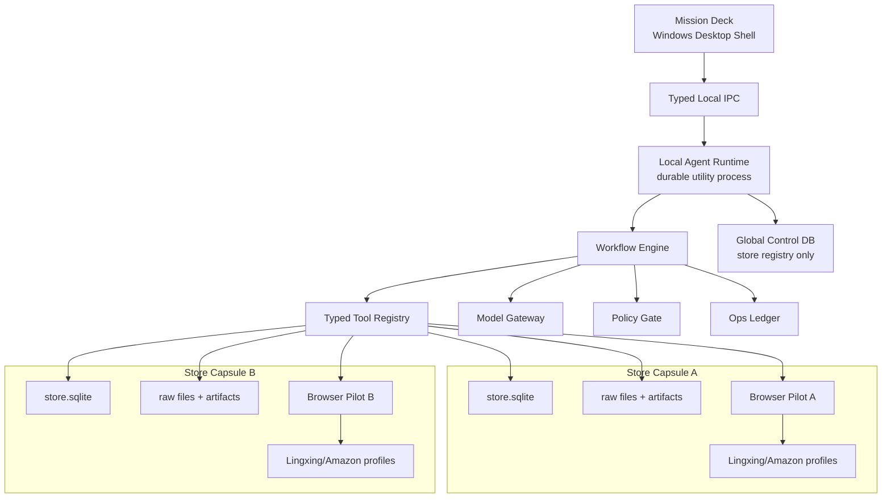
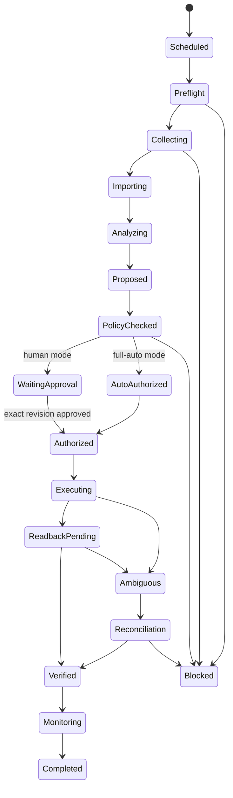

# Amazon Ops Autonomy - Greenfield Solution Design

> Generated by `all-plan` (`designer` + `inspiration` + `reviewer`)

## Overview

**Goal**: 从零建设一个 Windows 本地运行、以店铺为隔离单元、能够持续采集领星广告数据、完成量化与 AI 决策，并在人工审批或策略自动批准后真实执行广告调整且完成回读的 Amazon 运营自治系统。

**Working name**: `运营巡航台 / Ops Autopilot`

**Readiness Score**: 91/100

**Review Score**: 8.3/10 — passed round 1; critical findings incorporated

**Generated**: 2026-07-20

---

## 1. Design Brief

### 1.1 Problem Statement

第一位用户是系统所有者本人。由于无法取得公司管理员级的领星 API 授权，系统必须在 Windows 电脑开机且应用运行时，通过每个店铺独立的可见浏览器会话完成领星报告采集和广告网页执行。

产品要解决的不是“给数据加一个聊天框”，而是形成一个可持续运行的业务闭环：

```text
按店铺采集真实数据
→ 校验并量化
→ 结合配置、历史活动和 AI 形成调整方案
→ 人工批准或策略自动批准
→ 在网页真实执行
→ 刷新回读
→ 记录事实、决策、动作和后续结果
→ 支持以后按店铺、对象、日期和事件精准检索
```

### 1.2 Confirmed Requirements

- 单用户、自用、Windows 本地运行。
- 电脑关闭后不要求继续运行；应用重新打开后必须恢复未完成任务。
- 店铺数量可配置，每个店铺的数据、浏览器身份、任务、AI 记忆和执行权限相互隔离。
- 通过可见浏览器和领星下载中心稳定获取广告报告。
- 保存每日指标、广告调整、促销活动、价格变化、Listing 变化等运营事件。
- 使用确定性规则、用户配置和 AI 共同生成调整建议。
- 支持 `人工审批` 与 `AI 全自动` 两种执行模式。
- 第一版必须包含真实广告自动执行，不允许只做模拟或建议。
- 历史查询必须精确回到真实数据、文件、行、动作和回读证据。

### 1.3 In Scope

- 店铺创建、启停、切换、备份和健康检查。
- 每店铺独立的领星与 Amazon Ads 浏览器 Profile。
- 定时及手动报表采集、失败重试、页面漂移诊断。
- 原始文件归档、标准化导入、数据质量和去重。
- 广告指标、产品成本目标和运营事件账本。
- AI 调查、解释、计划与历史问答。
- 确定性策略门、审批队列、自动授权和紧急停止。
- 真实广告动作、执行前/后/刷新回读与证据固定。
- Windows 安装包、升级、备份恢复和运行诊断。

### 1.4 Explicitly Out of Scope for V1

- SaaS、多租户、团队权限和云端常驻调度。
- 手机端、远程网页控制台和跨设备同步。
- 依赖领星、Amazon Ads 或 SP-API 的正式授权。
- 让 LLM 自由点击网页、直接写数据库或直接获得凭证。
- 自动修改 Listing、创建复杂广告结构或无约束扩大预算。
- 用向量检索结果代替结构化业务事实。

### 1.5 Clarification Summary

| Dimension | Score | Status | Notes |
|---|---:|---|---|
| Problem Clarity | 29/30 | Defined | 自用、多店铺、从采集到执行和记忆的闭环明确 |
| Functional Scope | 23/25 | Defined | 两种执行模式与真实自动执行明确 |
| Success Criteria | 17/20 | Defined with defaults | 业务阈值可配置，系统安全不变量不可配置掉 |
| Constraints | 14/15 | Defined | Windows、本地、可见浏览器、无管理员 API 授权 |
| Priority / MVP | 8/10 | Defined | V1 必须证明真实自动执行；动作类型先受控收窄 |
| **Total** | **91/100** | **Ready** | 可进入架构和实施设计 |

### 1.6 Assumptions to Validate During Build

- V1 用至少两个测试店铺证明隔离，但真实自动写入先在一个店铺、少量对象上做 canary。
- V1 自动动作优先支持可读取、可验证、相对可逆的 `adjust_bid` 和 `pause/resume target`。
- 否词、预算扩大和广告结构创建先进入人工审批，达到真实成功率门槛后再允许自动授权。
- AI Provider 可配置，但参与真实自动执行的模型必须通过结构化工具调用、Schema 遵循和回归评测门。

---

## 2. Non-Negotiable Product Principles

### 2.1 Store Is a Security Boundary, Not a Filter

每个店铺是一个独立 `Store Capsule / 店铺舱`，至少拥有独立：

- 数据库文件
- 原始报告与证据目录
- 领星浏览器 Profile
- Amazon Ads 浏览器 Profile
- 调度队列与写入锁
- 配置版本与自治预算
- AI 运行上下文和运营账本

跨店铺总览只能调用只读聚合工具。任何写动作必须显式携带唯一 `storeId`，并在网页中重新读取和核对店铺、广告账号、站点和币种。

`storeId` 不是调用方可以任意填写的字符串。UI 只能获得不透明的 `StoreCapability`；Local Agent Runtime 在服务端把 capability 解析为规范店铺资源，随后为该店铺启动一个 store-scoped worker。Worker 只接收已解析的 DB、Profile 和 artifact 句柄，不接受任意路径。所有路径执行 canonicalization 与 capsule-root containment 检查。

这里的隔离威胁模型是“阻止应用缺陷、错误工具调用、Prompt injection 和跨店任务串号”，不是抵御已经控制当前 Windows 用户账户的恶意管理员。若未来要求对本机管理员也隔离，需要提升为不同 Windows 账户或虚拟机边界。

### 2.2 AI Plans; Deterministic Tools Act

AI 可以：

- 分解目标
- 选择只读调查工具
- 形成假设和候选方案
- 解释证据和不确定性
- 生成结构化动作提案

AI 不可以：

- 直接执行 DOM 点击或填写
- 绕过策略门
- 修改自身权限
- 直接写业务数据库
- 把网页文本当系统指令
- 把无法确认的执行称为成功

### 2.3 Full Auto Means Policy-Approved, Not Unlimited

人工模式和全自动模式共用完全相同的动作流水线。唯一差异是批准来源：

| Stage | Human Approval Mode | AI Full-Auto Mode |
|---|---|---|
| 调查、量化、AI 建议 | 相同 | 相同 |
| 确定性安全预检 | 必须通过 | 必须通过 |
| 批准来源 | 用户批准精确 revision | 预先配置的策略 revision 自动批准 |
| 执行前网页身份与数值比对 | 必须通过 | 必须通过 |
| 执行、截图、刷新回读 | 相同 | 相同 |
| 失败或结果不确定 | 停止并人工接管 | 停止并人工接管 |

### 2.4 Facts, Decisions and Memory Must Be Separated

- **事实层**：真实报表、页面读数、数据库行和文件哈希。
- **计算层**：确定性指标和规则结果，可重复计算。
- **决策层**：AI/规则提案、批准来源、配置 revision。
- **执行层**：网页动作及前后值。
- **记忆层**：对 Episode 的摘要和经验，只能引用以上事实，不能成为事实本身。

### 2.5 Unknown Is a First-Class State

网页点击超时可能发生在“动作已经提交、程序却没收到响应”之后。因此执行状态必须包含 `AMBIGUOUS`，遇到未知结果时先重新读取网页和对账，禁止盲目重试。

---

## 3. Architecture Decision

### 3.1 Options Considered

| Option | Description | Decision |
|---|---|---|
| A. Electron 单体 | UI、AI、调度、数据库和浏览器都在主进程体系 | 适合原型；长期任务恢复、崩溃隔离和维护边界不足，拒绝 |
| B. 薄桌面控制台 + 本地持久化 Agent Runtime + 浏览器 Worker | 一个 Windows 安装包，内部进程分离 | **选择**；符合本地自用，又保留耐久运行和演进空间 |
| C. 云控制面 + 本地执行器 | 云端规划，本地浏览器执行 | 暂缓；当前没有多用户、离线调度和远程控制需求 |
| D. 本地微服务平台 | 多服务、消息总线、外部工作流引擎 | 拒绝用于 V1；运维成本超过收益 |

### 3.2 Selected Architecture



### 3.3 Runtime Ownership and Capabilities

| Process | May Own | Must Not Own |
|---|---|---|
| Desktop Renderer | 当前页面状态、不透明 store/run/action handle | 文件路径、DB 连接、Cookie、凭证、浏览器控制权 |
| Electron Main | 窗口、升级、utility process 生命周期、最小 IPC 路由 | 业务决策、报表解析、外部广告写入 |
| Local Agent Runtime | 全局调度、workflow、policy、capability registry | 直接操作 DOM、把任意 UI 路径转交 worker |
| Store Worker | 单个 capability 对应的 DB/Profile/artifact、单店 lease | 其他店铺路径、全局店铺列表、跨店查询 |
| Browser Worker | 单店、单 connector、单次 session 的页面与下载 | 业务策略、模型 Key、其他 connector Profile |

IPC 请求只携带 opaque handle、operation 和 typed payload。Runtime 必须从自己的注册表查找真实资源，并验证 `handle → store → run → action revision` 关系；任何 caller-supplied 路径和未绑定的 `storeId` 均拒绝。

### 3.4 Why Electron Remains Acceptable

Electron 在这里不是业务架构，只是 Windows 控制台和进程监管外壳。UI renderer 保持沙箱化；长任务、AI、数据库和 Playwright 放在独立 utility process / worker 中。Electron 官方文档明确将 utility process 定位为适合 CPU 密集、易崩溃或不应放在 Main 的 Node 服务进程，并支持 MessagePort 通信。

### 3.5 Technology Baseline

| Layer | Choice | Rationale |
|---|---|---|
| Language | TypeScript | UI、Agent、工具 Schema 和 Playwright 共用类型 |
| Desktop shell | Electron + React | Windows 打包成熟；只负责控制台、更新和进程生命周期 |
| Agent runtime | Node.js utility process | 与 UI/Main 崩溃和长任务隔离；应用退出时可安全暂停 |
| Browser automation | Playwright headed Chromium | 可见浏览器、持久 Profile、截图、trace 和下载支持 |
| Operational storage | SQLite per store + WAL | 本地单用户、事务可靠、便于按店铺备份和物理隔离 |
| Raw/artifact storage | Immutable local files | 保留原始报告、截图、DOM、trace 和哈希 |
| Validation | Zod + JSON Schema | 工具输入输出、模型输出和 IPC 全部强类型 |
| UI state | Query cache + event stream | UI 只显示 runtime 真状态，不自行推断业务完成 |
| Testing | Vitest + Playwright + fault injection | 合同、状态机、浏览器漂移和真实 canary 分层验证 |

SQLite 官方说明 WAL 允许读取者与写入者并行，但仍只有一个 writer；因此每店铺采用单写入队列，并让所有业务写入在事务中完成。SQLite 文件必须保持本地，不放网络盘。

---

## 4. Core Components

### 4.1 Mission Deck

任务优先的桌面控制台，不以传统功能菜单为中心。首屏回答：

- 今天哪些店铺已完成采集？
- AI 正在调查什么？
- 哪些动作等待审批？
- 哪些动作已自动执行？
- 哪些动作回读失败或结果不确定？
- 昨日、3 日和 7 日观察窗口有什么变化？

### 4.2 Store Capsule Manager

职责：

- 创建、启停和切换店铺舱。
- 分配独立路径、数据库、Profile、配置和队列。
- 对每次工具调用注入不可变 `storeId`。
- 向 UI 和 Agent 发放不可伪造、可撤销的不透明 capability，而不是文件路径。
- 执行跨店铺访问控制。
- 提供单店备份、恢复和删除前导出。

建议目录：

```text
%LOCALAPPDATA%/OpsAutopilot/
  control/control.sqlite
  stores/{storeId}/
    store.sqlite
    config/
    browser/lingxing/
    browser/amazon-ads/
    raw/{yyyy}/{mm}/{dd}/
    artifacts/{runId}/
    exports/
```

浏览器 Profile 含敏感 Cookie。Playwright 官方建议为自动化创建独立 `userDataDir`，不要使用日常 Chrome 默认 Profile，也不要提交认证状态文件。目录使用 Windows 用户 ACL，凭证和 AI Key 使用 Windows DPAPI/Electron safe storage。

### 4.3 Durable Workflow Engine

工作流状态存在 SQLite，不依赖内存中的 Promise 或聊天会话。每个运行包含：

- `run`
- `step`
- `attempt`
- `lease`
- `heartbeat`
- `input_hash`
- `output_hash`
- `tool_version`
- `config_revision`
- `model_revision`
- `artifact_refs`

关闭应用时，运行进入 `PAUSED_APP_EXIT`；下次启动对非终态运行进行租约恢复和幂等重放。

### 4.4 Typed Tool Registry

工具按副作用分类：

**Read-only**

- `verify_store_identity`
- `inspect_session_health`
- `collect_lingxing_reports`
- `verify_report_batch`
- `query_metrics`
- `query_operation_events`
- `compare_periods`
- `read_live_ad_value`

**Local writes**

- `import_report_batch`
- `record_operation_event`
- `save_recommendation`
- `create_action_revision`
- `record_outcome_window`

**External writes**

- `execute_bid_change`
- `execute_target_pause`
- `execute_target_resume`
- 后续扩展 `execute_negative_keyword`、`execute_budget_change`

每个工具必须包含：

- 输入/输出 Schema
- `storeId`、`runId`、`toolVersion`
- 幂等策略
- 超时和重试策略
- 可否并行
- 所需权限和批准规则
- 失败分类
- 证据产物
- 回读或补偿要求

### 4.5 Model Gateway and Agent Kernel

业务数据库不依赖任何 Agent SDK 的私有序列化格式。定义自有接口：

```ts
interface AgentKernel {
  investigate(input: InvestigationInput): Promise<InvestigationResult>
  propose(input: ProposalInput): Promise<ActionProposal[]>
  explain(input: ExplainInput): Promise<EvidenceBoundAnswer>
}
```

第一实现可采用 OpenAI Agents SDK，因为其官方 TypeScript 文档已经提供：

- function tools
- tool guardrails
- run turn limits
- 可序列化和恢复的 approval interruption
- 人工批准与程序化批准

但业务 `run/step/action/approval/readback` 仍以自有数据库为准。其他模型只要通过结构化工具调用兼容测试即可接入；未通过的模型只能用于文案解释，不得参与自动写入决策。

### 4.6 Policy Gate

它是确定性代码，不是 Prompt。每个店铺都保存版本化自治预算：

- 执行模式
- 允许的动作类型
- 单次出价最大增减百分比
- 单日动作数量
- 单日预算影响上限
- 最低数据完整度和新鲜度
- 最低样本量与置信度
- 冷却时间
- 黑名单/白名单 campaign、ad group、ASIN、target
- 禁止执行时段
- 页面身份必须匹配的字段
- 连续失败自动熔断阈值
- 全局和单店 kill switch

安全不变量不可通过配置关闭：店铺身份比对、执行前值比对、revision 绑定、幂等、防重复、执行后刷新回读、未知状态停机。

### 4.7 Browser Pilot

把网页自动化视作工业动作执行器，而不是录制宏。

- 每店铺独立 persistent browser context。
- 一次只允许一个外部写任务持有该店铺的 write lease。
- 页面适配器、页面指纹和选择器均版本化。
- 采集与执行前先通过身份、URL、页面指纹和目标对象预检。
- 读取目标当前值，与提案的 `expectedBefore` 比对。
- 截图并写入执行意图后，才允许点击提交。
- 最终提交前消费一次性短时 `ExecutionPermit`；permit 绑定 store/action/policy/config revision、kill-switch epoch、expectedBefore 和过期时间。
- `consumeExecutionPermit` 使用事务 CAS。kill switch、policy 或 action revision 变化会推进 epoch，使尚未消费的 permit 立即失效。
- 提交后读取页面值、刷新页面、再次读取。
- CAPTCHA、登录过期、页面未知、对象消失、数值不匹配时停止。
- LLM/视觉模型可以在只读诊断模式解释页面漂移，但不能在生产写路径自由点击。

### 4.8 Ops Ledger

将每个运营过程保存为可追溯 Episode：

```text
事实快照
→ 问题/机会
→ 规则与 AI 判断
→ 动作 revision
→ 批准来源
→ 网页执行
→ before / after / reload
→ 1 日 / 3 日 / 7 日观察
→ 结论与后续任务
```

### 4.9 Precise Retrieval

查询顺序固定为：

1. 明确当前 `storeId`；跨店查询必须显式选择。
2. 解析日期、ASIN、campaign、ad group、target、事件类型和指标粒度。
3. 先执行结构化 SQL / fact query。
4. 返回行数、数据窗口、批次、报告类型和源文件引用。
5. AI 只负责解释结果和生成后续问题。
6. 非结构化笔记可用全文/向量召回帮助发现，但不能单独证明结论。

---

## 5. Store Data Model

### 5.1 Global Control DB

只保存非业务控制信息：

- `stores`
- `store_health`
- `global_settings`
- `runtime_versions`
- `update_history`
- `backup_index`

### 5.2 Per-Store DB

| Aggregate | Core Tables | Purpose |
|---|---|---|
| Report ingestion | `report_batches`, `report_files`, `import_jobs` | 真实文件、哈希、覆盖范围、状态和重试 |
| Facts | `ad_metric_facts`, `product_configs` | 每日广告事实和经营目标 |
| Context | `operation_events` | Coupon、Deal、价格、库存、Listing、人工广告动作等 |
| Agent runtime | `agent_runs`, `run_steps`, `tool_calls` | 耐久任务与工具调用 |
| Decisions | `recommendations`, `action_revisions`, `policy_decisions` | 规则/AI 提案和批准来源 |
| Execution | `executions`, `readbacks`, `execution_artifacts` | before/after/reload、截图、trace 和状态 |
| Memory | `episodes`, `outcome_windows`, `memory_summaries` | 1/3/7 日观察和可引用经验 |
| Audit | `audit_events`, `config_revisions`, `model_calls` | 版本、成本、错误和不可抵赖链 |

### 5.3 Canonical Ad-Entity Registry

领星报表中的名称不能直接作为 Amazon Ads 网页写入身份。每店铺建立规范对象注册表：

| Table | Required Fields |
|---|---|
| `ad_accounts` | marketplace、accountId、displayName、currency、source identities、verifiedAt |
| `ad_entities` | canonicalEntityId、entityType、campaignId、adGroupId、targetId、lifecycleState |
| `entity_aliases` | sourceSystem、sourceId、sourceName、validFrom、validTo、canonicalEntityId |
| `entity_resolutions` | source evidence、resolution method、confidence、review status、revision |

规则：

- 外部写只接受 Amazon 页面重新读取并确认的稳定 ID；名称只用于显示和候选发现。
- 同名 campaign/ad group/target、对象重命名、归档重建和缺 ID 均不得自动猜测。
- 任何一对多、多对一或低置信映射进入 `IDENTITY_AMBIGUOUS`，只能人工解决，不能执行。
- Action revision 绑定 canonical ID 和 resolution revision；映射更新后旧 action 自动过期。

### 5.4 Required Business Scope

每个业务对象至少绑定：

```text
storeId + marketplace + dateFrom/dateTo + batchId
+ asin + campaign + adGroup + target/entityId（按对象可选）
```

每条指标保留 `sourceFile + sourceRow + reportType + sourceHash`。不同报告粒度不直接相加，必须选择 canonical 汇总来源。

### 5.5 Temporal Semantics

每日事实和运营事件使用双时间语义，避免迟到报表、修订文件和跨日活动污染历史答案：

- `businessDate`：业务归属日期。
- `observedAt`：网页或文件中观察到该事实的时间。
- `ingestedAt`：进入本地系统的时间。
- `sourceTimezone`：来源站点时区。
- `validFrom/validTo`：实体名称、配置或活动的有效区间。
- `attributionWindowDays`：订单/销售归因窗口。
- `supersedesId`：更正文件或人工修订所替代的记录。

事实不原地覆盖；修订以新版本 supersede 旧版本。历史查询必须明确按“当时已知”还是“当前修订后”口径返回结果。

---

## 6. Daily Autonomous Workflow



### 6.1 Run Sequence

1. **Select store capsule**: 获取单店运行 lease，装载配置 revision。
2. **Identity preflight**: 可见浏览器核对领星店铺、Amazon 广告账号、站点、币种和登录状态。
3. **Collect**: 按配置窗口创建并下载默认八类广告报告；单类失败不阻断其他类。
4. **Verify and import**: 校验真实文件、日期、类型、哈希和必需列；事务化、幂等导入。
5. **Attach context**: 读取当天及历史运营事件、产品成本和目标。
6. **Quantify**: 计算 canonical 指标、趋势、样本充分度、规则候选和风险。
7. **AI investigate**: AI 通过只读工具提出假设，输出证据引用和不确定性。
8. **Create action revisions**: 每个动作绑定对象身份、before、after、原因、证据、配置和模型版本。
9. **Policy decision**: 人工模式进入审批；全自动模式由自治预算决定自动批准、降级审批或阻断。
10. **Execute serially**: 每店铺单写入，执行前再次读取身份和当前值。
11. **Read back**: 保存 before、after 和 reload 三阶段证据；不一致进入 `AMBIGUOUS`。
12. **Observe**: 生成 1/3/7 日 outcome window，形成下一轮任务但不夸大因果关系。

---

## 7. Action Contract

每一种外部写动作必须实现同一合同：

```ts
interface ActionContract {
  actionId: string
  revision: number
  storeId: string
  runId: string
  actionType: 'adjust_bid' | 'pause_target' | 'resume_target'
  target: {
    marketplace: string
    campaignId: string
    adGroupId: string
    entityType: 'keyword' | 'auto_targeting' | 'product_targeting'
    entityId: string
  }
  expectedBefore: string
  proposedAfter: string
  evidenceRefs: string[]
  configRevision: number
  policyRevision: number
  idempotencyKey: string
  preconditions: Precondition[]
  readback: ReadbackContract
  compensation?: CompensationContract
}
```

### 7.1 Execution State

```text
DRAFT
→ PRECHECKED
→ WAITING_APPROVAL / APPROVED_BY_POLICY
→ EXECUTING
→ READBACK_PENDING
→ VERIFIED / FAILED / AMBIGUOUS / REJECTED / EXPIRED
```

批准必须绑定精确 action revision；AI 或数据更新后旧批准自动失效。

最终提交采用短时许可：Policy Gate 只在全部预检通过后签发 `ExecutionPermit`。Browser Worker 必须在点击提交前立即重新读取页面身份和 before 值、事务消费 permit，并在数秒 TTL 内完成提交。许可只能消费一次；kill switch、policy/config/action/entity-resolution revision 任一变化都会使其失效。即使如此仍不宣称网页 exactly-once，超时继续进入 `AMBIGUOUS` 对账。

### 7.2 V1 Real Auto-Execution Boundary

V1 必须真实执行，但不是一次开放所有动作：

- 首个 canary：单店、白名单 campaign、少量 target、`adjust_bid`。
- 第二个合同：`pause/resume target`。
- 默认单次出价变化上限建议 10%，但由用户在安全范围内配置。
- 每次执行前必须读取真实值；与 expectedBefore 不同即生成新 revision，不覆盖页面。
- 连续一次回读不一致即可暂停该店自动模式，阈值可以更严格但不能更宽松到忽略不一致。
- 否词、预算扩大和创建/归档 campaign 在 V1 默认要求人工审批。

---

## 8. Configuration Model

### 8.1 Store Configuration

- 店铺显示名、内部 `storeId`、站点、币种、时区。
- 领星与 Amazon 浏览器 Profile。
- 报表清单、采集时间、业务日期窗口、重试次数。
- ASIN/MSKU 范围和白名单/黑名单对象。
- 产品成本、FBA、售价、最低售价、目标 ACOS/TACOS/净利率。
- 数据新鲜度、最小样本、无订单点击、高 ACOS、CPC 和 CVR 阈值。
- 模型、温度、最大工具轮次和成本预算。
- 人工审批或全自动模式。
- 自治预算、执行时段、冷却期和熔断设置。

### 8.2 System Invariants

以下不提供关闭选项：

- 店铺身份匹配。
- 数据来源与文件哈希记录。
- 配置/建议/action revision 绑定。
- 外部写幂等和单店写入 lease。
- 执行前值比对。
- before/after/reload 回读。
- 结果不确定时停机。
- 跨店铺写入拒绝。
- 密钥和浏览器认证状态不进入 Prompt、日志或导出。

---

## 9. User Experience

### 9.1 Primary Surfaces

1. **Mission Deck / 今日任务中枢**
   按店铺展示采集、分析、待审批、执行、回读和观察窗口。

2. **Store Switcher / 店铺气闸**
   切换时卸载当前写上下文，再装载目标店铺；始终展示店铺、站点和自动模式状态。

3. **Decision Inbox / 决策收件箱**
   展示 action diff、证据、风险、预期影响和精确 revision。

4. **Ops Ledger / 运营账本**
   以 Episode 时间线展示事实、活动、建议、执行和 1/3/7 日结果。

5. **Ask the Store / 问店铺**
   用自然语言查询，但回答必须带数据窗口、粒度、记录 ID 和源文件引用。

6. **Policies / 自治策略**
   配置执行模式、允许动作、阈值、预算、冷却期和 kill switch。

7. **Browser Pilot / 浏览器驾驶舱**
   显示真实可见页面、当前步骤和人工接管入口，不在应用内伪造网页状态。

### 9.2 Goal-Oriented Interaction

用户可以设置持续目标，例如：

> 本周在订单下降不超过 5% 的前提下，将当前店铺目标 ASIN 的 ACOS 降到 28%。

系统把目标保存为版本化 `Objective`，每日运行只提出在自治预算内的具体动作。目标本身不能覆盖执行安全门。

---

## 10. Reliability, Security and Observability

### 10.1 Reliability

- 每店铺单 writer，读任务可并行。
- 所有步骤幂等；外部写使用意图记录 + 当前值读取 + readback，而非宣称 exactly-once。
- 应用退出前释放浏览器和数据库，非终态运行持久化暂停。
- 页面适配器有版本、健康检查、fixture 和真实 canary。
- 自动重试只适用于明确未发生副作用的步骤。

### 10.2 Security

- Renderer sandbox + context isolation；最小化 IPC。
- Agent runtime、browser worker 与 UI 进程隔离。
- Browser Profile 和 DB 只在当前 Windows 用户目录。
- 凭证/Key 用 DPAPI/safe storage；Cookie 不复制进业务 DB。
- 网页、报表和用户笔记全部作为不可信数据，不允许注入系统指令。
- 模型工具调用经过输入、输出和策略 guardrail。
- 导出前执行 secret scan。

### 10.3 Observability

每次运行必须可回答：

- 哪个店铺、哪个配置和模型版本？
- 使用了哪些源文件和数据窗口？
- 调用了哪些工具，输入输出哈希是什么？
- 为什么建议这个动作？
- 谁或哪条策略批准？
- 网页执行前后和刷新后是什么值？
- 后续 1/3/7 日发生了什么？

---

## 11. Greenfield Repository Structure

```text
ops-autopilot/
  apps/
    desktop-shell/
    agent-runtime/
  packages/
    contracts/
    domain/
    workflow-engine/
    store-capsule/
    tool-registry/
    model-gateway/
    policy-engine/
    data-pipeline/
    ops-ledger/
    browser-core/
    connector-lingxing/
    connector-amazon-ads-ui/
    retrieval/
    audit/
  resources/
    page-models/
    report-schemas/
    default-policies/
    prompts/
  tests/
    fixtures/
    contract/
    drift/
    recovery/
    cross-store/
    live-canary/
  docs/
    architecture/
    action-contracts/
    runbooks/
    threat-model/
```

依赖方向固定为：`apps → orchestration → domain/tools → adapters`。Connector 不得反向依赖 UI 或 Agent Prompt。

---

## 12. Implementation Plan

### Step 0: Freeze the Contracts Before Screens

**Actions**

- 定义 store identity、业务 scope、八类报告、指标粒度、operation event、action revision、policy decision、execution 和 readback Schema。
- 定义系统安全不变量与可配置业务阈值边界。
- 建立状态机、错误分类、幂等规则和 artifact 目录合同。
- 定义 canonical ad-entity registry、双时间事实、opaque store capability 和短时 ExecutionPermit。
- 在扩展产品 UI 前完成真实技术 spike：分别证明领星店铺身份/八类报告下载、Amazon Ads 稳定 entity ID/当前值读取、一次受控提交与 reload 回读。

**Deliverables**

- Architecture Decision Records。
- Versioned TypeScript contracts。
- Action Contract v1。
- Data/identity threat model。
- Real-page feasibility report，覆盖登录过期、同名对象、虚拟化表格和页面漂移样例。

**Acceptance**

- 跨店写、旧 revision 批准、before 不匹配、重复执行和回读不一致均有失败测试。
- 真实页面 spike 若无法稳定解析账号与 entity ID，则暂停产品扩展，先解决 connector 身份合同。

### Step 1: Build Store Capsules and Runtime Skeleton

**Actions**

- 建立 desktop shell、agent runtime utility process 和 typed IPC。
- 建立 global control DB 和 per-store SQLite migration。
- 创建每店铺路径、浏览器 Profile、队列和写入 lease。
- 实现 opaque capability registry、server-side resource lookup、canonical path containment 和 store-scoped worker。
- 实现安全退出、暂停和恢复。

**Deliverables**

- 可创建/切换/备份两个隔离店铺舱。
- Crash/restart recovery harness。

**Acceptance**

- 自动化攻击测试证明 A 店运行无法读取或写入 B 店 DB、Profile 和 artifact。
- 篡改 store handle、storeId、路径、run/action handle 的 IPC 请求全部 fail-closed。
- 应用在任意非外部写步骤退出后可恢复且不重复导入。

### Step 2: Build the Lingxing Data Conveyor

**Actions**

- 实现可见 persistent browser、登录健康、店铺身份读取和页面指纹。
- 实现报告创建、轮询、下载、单类重试、文件验证和批次 manifest。
- 实现八类报告标准化、canonical grain 和事务导入。

**Deliverables**

- 每店铺定时/手动采集。
- 真实文件和导入质量账本。
- 页面漂移诊断包。

**Acceptance**

- 默认八类报告唯一齐全；文件/manifest/DB scope 一致。
- 每类最多自动重试 2 次；仍失败时保存原因、截图、DOM 和 trace。
- canonical spend/orders/sales 与原表差异不超过 0.01。

### Step 3: Build Facts, Configuration and Ops Ledger

**Actions**

- 实现产品成本/售价/ACOS/TACOS/净利润配置。
- 实现规则阈值与版本化配置。
- 实现促销、价格、库存、Listing 和人工动作事件。
- 实现 Episode、fact references 和 outcome windows。

**Deliverables**

- 可查询的店铺事实和事件时间线。
- 配置 revision 与变更审计。

**Acceptance**

- 任意指标、建议和 Episode 可回到 store、日期、grain、batch、source file 和 source row。

### Step 4: Build the Read-Only Daily Analyst

**Actions**

- 实现确定性量化和规则候选。
- 实现 Agent Kernel、只读工具、证据充分度和结构化提案。
- 建立模型 capability certification 和 prompt/model versioning。
- 实现目标分解和自然语言历史查询。

**Deliverables**

- 每日调查报告、候选动作和证据解释。
- Ask the Store 的 SQL-first 答案。

**Acceptance**

- AI 提案 100% 引用真实 evidence ID；缺数据时阻断真实动作。
- Prompt injection fixture 不能触发外部写工具或跨店读取。

### Step 5: Build Human-Approval Real Execution

**Actions**

- 实现 Amazon Ads 网页身份预检和 live current-value 读取。
- 实现 `adjust_bid` 与 `pause/resume target` 动作合同。
- 实现精确 revision 审批、before/after/reload 截图和 readback。
- 实现一次性短时 ExecutionPermit、kill-switch epoch 和提交边界 CAS。
- 实现 `AMBIGUOUS` 对账和人工接管。

**Deliverables**

- 人工批准后的真实广告执行闭环。
- 每动作独立证据包。

**Acceptance**

- 真实 canary 动作保存不同的 before、after、reload 证据，reload 值等于目标值。
- 重复点击、应用崩溃和超时不会造成盲目二次写入。

### Step 6: Turn On Policy-Gated Full Auto

**Actions**

- 实现自治预算、白名单、限额、冷却期、执行窗口、熔断和 kill switch。
- 自动模式将合格 action revision 标记为 `APPROVED_BY_POLICY`。
- 新动作类型先影子运行，再人工模式，再进入自动 canary。

**Deliverables**

- 单店受控全自动运行。
- 自动授权理由和 policy revision 证据。

**Acceptance**

- 至少一个真实 `adjust_bid` 动作在无人点击批准按钮的情况下，由预先配置策略批准、执行并回读成功。
- 任一身份、数据新鲜度、before 值、预算或回读门失败时均无外部写入或立即熔断。
- kill switch、policy 或 action revision 在“已预检、未提交”窗口变化时，旧 permit 无法被消费。

### Step 7: Productize Mission Deck and Retrieval

**Actions**

- 建立任务中枢、店铺气闸、审批收件箱、运营账本、问店铺和策略界面。
- 展示运行进度、阻断原因、证据和人工接管入口。
- 建立跨店铺只读聚合，禁止从聚合视图直接执行。

**Deliverables**

- 面向日常运营的完整 Windows UI。
- 精准检索与带引用回答。

**Acceptance**

- 用户不需要理解内部模块即可完成“登录→采集→建议→选择模式→执行→回读→查询历史”。

### Step 8: Harden, Package and Operate

**Actions**

- 完成安装/升级/回滚、DB 迁移、Profile 迁移、备份恢复和 secret scan。
- 建立页面 drift、验证码、网络断开、磁盘满、SQLite 锁、模型超时和进程崩溃演练。
- 建立版本化 live canary 和交付 manifest。

**Deliverables**

- Windows installer 和 portable diagnostic bundle。
- 运维手册、恢复手册和自动执行安全报告。

**Acceptance**

- 当前安装包身份、Schema、Page Adapter、模型能力、真实 canary 和回读证据由同一 manifest 绑定。

---

## 13. MVP Acceptance Gates

### 13.1 Hard Gates

- [ ] 至少两个店铺舱完成物理数据/Profile/队列隔离测试，零跨店读取和写入。
- [ ] Store capability、run/action handle 和路径篡改的 adversarial IPC 套件全部 fail-closed。
- [ ] 默认八类真实报告可按店铺完成采集、文件验证、幂等导入和 0.01 汇总对账。
- [ ] 两个测试店铺各完成连续 7 个计划运行日；每次要么 8/8 完成，要么明确进入可操作的 BLOCKED，且零错店、零静默缺数、零重复导入。
- [ ] 单类失败不阻断其他类，最多重试 2 次并保存完整诊断证据。
- [ ] 每条建议绑定 store、scope、grain、batch、source file/row、config/model revision。
- [ ] 人工审批模式完成一次真实广告动作和独立 reload 回读。
- [ ] 全自动模式完成一次策略自动批准的真实广告动作和独立 reload 回读。
- [ ] 真实自动 canary 累计至少 5 个动作，跨至少 3 次应用启动会话；100% 命中正确 store/entity，100% 产生独立 readback，任何失败均未盲目重试。
- [ ] before 不匹配、页面身份不匹配、回读不一致、旧 revision 和重复 idempotency key 均被阻断。
- [ ] 同名对象、对象重命名、缺失 ID 和多义映射进入 `IDENTITY_AMBIGUOUS`，不产生真实写入。
- [ ] kill switch/policy/action revision 在最终提交前变化时，短时 ExecutionPermit 失效。
- [ ] 应用关闭/崩溃后恢复，不重复下载、导入、批准或外部写入。
- [ ] 任意历史回答明确店铺、日期、指标粒度和证据引用。
- [ ] 固定检索语料覆盖迟到报表、更正文件、重命名对象和跨日活动；结构化答案 store/scope/row/provenance 100% 匹配黄金结果，本机基准数据集 p95 小于 2 秒。
- [ ] kill switch 在新工具调用前生效，并停止该店铺所有后续外部写入。

### 13.2 Configurable Operational Defaults

这些默认值可以调整，但每次调整产生配置 revision：

- 每店铺采集时间。
- 报表日期窗口。
- 自动重试次数（默认 2）。
- 目标 ACOS/TACOS/利润率。
- 样本量、点击、花费、订单、CVR 和置信度阈值。
- 单次出价变化上限（初始建议 10%）。
- 每日动作数、预算影响和对象数上限。
- 冷却期和执行时段。
- 允许自动执行的动作类型和对象白名单。

---

## 14. Test Strategy

| Test Layer | What It Proves |
|---|---|
| Contract tests | Schema、revision、scope、policy 和 readback 不变量 |
| State-machine tests | 暂停、恢复、拒绝、过期、失败和 ambiguous 转移 |
| Store isolation tests | 路径、DB、Profile、queue 和 IPC 跨店攻击被拒绝 |
| Data reconciliation | 八类文件、manifest、DB、grain 和原表汇总一致 |
| Identity resolution | 领星事实到 Amazon canonical entity 的唯一映射、重命名和歧义拒绝 |
| Temporal retrieval | 迟到、修订、supersede、归因窗口和“当时已知/当前修订”查询 |
| Browser fixture tests | 页面正常、字段缺失、DOM 漂移、对象消失和提交超时 |
| Fault injection | 断网、进程退出、磁盘满、SQLite busy、模型超时 |
| Shadow runs | 真实页面只读比较建议与人工判断，不执行 |
| Human canary | 精确批准后的少量真实动作和 readback |
| Auto canary | 策略自动批准后的少量真实动作和熔断 |
| Long-running soak | 多店铺连续日运行、资源释放、任务恢复和无串号 |

---

## 15. Risks and Mitigations

| Risk | Impact | Likelihood | Mitigation |
|---|---|---|---|
| 店铺/广告账号串号 | Critical | Medium | Store Capsule、页面身份四元组核对、单店 write lease、跨店攻击测试 |
| capability/IPC 被伪造 | Critical | Medium | opaque handle、server-side lookup、path containment、store-scoped worker |
| 领星名称映射到错误 Ads 对象 | Critical | Medium | canonical entity registry、稳定 ID、resolution revision、歧义拒绝 |
| 网页改版或验证码 | High | High | 版本化 adapter、页面指纹、人工接管、停止自由点击 |
| 已提交但客户端超时 | Critical | Medium | intent log、before 读取、幂等键、reload 对账、AMBIGUOUS 状态 |
| 数据延迟产生错误建议 | High | Medium | 新鲜度/完整度门，缺数据只诊断不写入 |
| 全自动放大误判 | Critical | Medium | 自治预算、白名单、限额、冷却、熔断、kill switch |
| 最终提交前策略变化竞态 | Critical | Low/Medium | 短时 ExecutionPermit、epoch、事务 CAS、提交前再次校验 |
| LLM Prompt injection | High | Medium | 网页/报表视为不可信，typed tools、tool guardrails、AI 无 DOM/凭证权限 |
| SQLite 锁或损坏 | High | Low/Medium | 每店单 writer、WAL、事务、备份、integrity check、磁盘空间预检 |
| 模型升级改变行为 | High | Medium | model/prompt revision、离线评测、capability certification、逐版本 canary |
| 过早多 Agent 化 | Medium | Medium | V1 一个协调 Agent；风控、执行、回读用确定性组件 |
| 历史“记忆”污染事实 | High | Medium | SQL-first、事实/摘要分层、回答强制 evidence refs |

---

## 16. Inspiration Filter and Credits

| Idea | Status | Integration |
|---|---|---|
| Store Capsule / 店铺舱 | Adopted | 店铺成为数据库、Profile、队列、配置和记忆的物理隔离边界 |
| Mission Deck / 任务中枢 | Adopted | 首页围绕每日运行和异常，而不是传统功能菜单 |
| Ops Ledger / 运营 Git | Adopted | 用 Episode 串联事实、决策、执行、回读和结果窗口 |
| Action Contract / 工业机器人 | Adopted | 每种网页写动作有 precondition、idempotency、证据和 readback 合同 |
| Autonomy Budget / 自治预算 | Adopted | 全自动由版本化策略批准，不取消安全门 |
| 五个 AI 角色 | Adapted | 保留职责分离，但 V1 为一个协调 Agent + 确定性风控/执行/回读 |
| 用店铺主题色保障隔离 | Discarded as control | 颜色只做提醒，安全依赖物理隔离与身份核对 |

---

## 17. Research and Domain Reference

### Current Official Technical References

- [OpenAI Agents SDK: Human-in-the-loop](https://openai.github.io/openai-agents-js/guides/human-in-the-loop/)
- [OpenAI Agents SDK: Guardrails](https://openai.github.io/openai-agents-js/guides/guardrails/)
- [OpenAI Agents SDK: Running agents](https://openai.github.io/openai-agents-js/guides/running-agents/)
- [Playwright BrowserType: launchPersistentContext](https://playwright.dev/docs/api/class-browsertype#browser-type-launch-persistent-context)
- [Electron Process Model and Utility Process](https://www.electronjs.org/docs/latest/tutorial/process-model)
- [SQLite Isolation](https://www.sqlite.org/isolation.html)
- [SQLite Write-Ahead Logging](https://www.sqlite.org/wal.html)

### Existing Domain Contracts Used Only as Reference

The greenfield design does not inherit the current UI or runtime architecture. It only uses domain knowledge already proven useful:

- Eight report types: `packages/lingxing-report-collector/src/report-types.ts:3`
- Business scope and action types: `packages/shared-types/src/action.ts:3`
- Metric provenance: `packages/shared-types/src/ad.ts:1`
- Product profit/target configuration: `packages/shared-types/src/profit.ts:1`
- Rule configuration: `packages/rules-engine/src/types.ts:3`
- Canonical metric grain: `packages/local-db/src/sqlite/ad-metric-grain.ts:18`
- Readback evidence contract: `packages/shared-types/src/ad-readback.ts:1`
- Existing measurable data gates: `docs/V1_5_ACCEPTANCE_MATRIX.md:174`

---

## 18. Review Summary

**Result**: PASS — 8.3/10, round 1. The plan was revised to incorporate all critical findings.

| Dimension | Score | Incorporated Follow-up |
|---|---:|---|
| Clarity | 9.0 | 增加进程所有权、opaque capability 和 IPC 边界 |
| Completeness | 8.0 | 增加 canonical entity registry 和双时间事实合同 |
| Feasibility | 7.5 | 增加真实页面前置 spike 和重复 packaged canary |
| Risk Assessment | 8.0 | 增加 store-scoped worker、ExecutionPermit 和 TOCTOU 防护 |
| Requirement Alignment | 9.0 | 增加连续日采集、5 次真实自动动作和精准检索黄金语料 |

Review critical issues addressed:

- 单一 runtime 可访问所有 capsule 的逻辑隔离不足。
- 领星事实到 Amazon Ads 精确对象缺少身份解析合同。
- Policy/kill switch 与最终点击之间存在 TOCTOU 窗口。
- 单次 canary 只能证明能力，不能证明稳定可用。

---

## 19. Final Recommendation

不要从“先做多少页面”开始。第一条工程主线应当是：

```text
两个隔离店铺舱
→ 一个真实领星采集闭环
→ 一个可追溯日分析闭环
→ 一个精确 revision 的人工执行闭环
→ 同一个动作合同切换为策略自动批准
→ 一个真实全自动 canary
```

只要这条链通过，产品就已经证明自己是本地 Amazon 运营自治系统；其他工作区、更多动作类型和更复杂的多 Agent 协作都可以在这条可信底座上递增。
