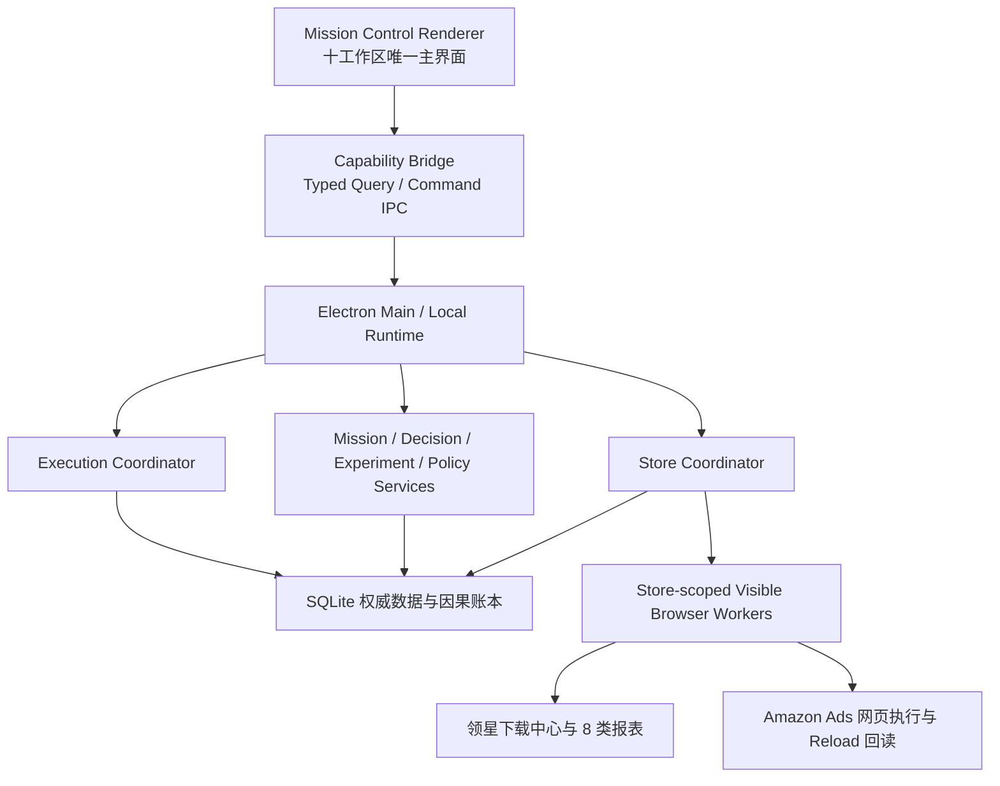

# Mission Control 生产对接实施计划

> `all-plan` 设计基线；以 `plans/amazon-ops-autonomy-greenfield-plan.md` 为架构母版，以当前 Mission Control 原型为产品与交互事实源，以现有 Electron 项目为生产能力底座。

**独立评审**：8.1/10，Round 1 PASS；五个维度均通过，评审要求已纳入阶段 0 基线、逐表迁移、首个真实 Ads canary 和连续采集 SLO。

## 1. 目标与决策

**目标**：把 `amazon-ai-ops-mission-control-prototype` 的十工作区、Mission 主链和店铺级交互升级为可打包的 Windows 生产应用，接入当前项目已有的领星真实采集、量化、AI、审批、安全与交付能力，并补齐真实 Amazon Ads 自动执行。

**当前决策**：

- V1 只支持 Amazon 美国站，`marketplace=US`、`currency=USD`。
- 支持多个美国站店铺；店铺是数据、会话、策略、任务和写入权限的隔离边界。
- 原型定义最终主窗口、导航、交互语义和业务主链；现有八工作区不再决定最终产品结构。
- 当前 `apps/desktop`、`packages/*` 和交付脚本是能力来源，按 Adapter 迁入原型主线。
- 第一版必须包含真实广告自动执行；人工审批与策略内自动共用一条执行链，只改变授权主体。
- 可见浏览器是唯一采集和执行现场；应用关闭后不运行，重新打开后恢复未完成任务。
- 每个大阶段结束后集中测试、修复、提交并推送；阶段内只做必要的编译和静态检查。

## 2. 规划就绪度

| 维度 | 分数 | 结论 |
| --- | ---: | --- |
| 问题清晰度 | 29/30 | 已明确从交互原型升级为真实自治系统 |
| 功能范围 | 23/25 | 十工作区、真实采集、双模式执行和精准历史均已定义 |
| 成功标准 | 18/20 | 生产包、真实采集、真实执行、回读和店铺隔离均有硬门 |
| 约束 | 14/15 | Windows、本地、可见浏览器、无管理员 API 授权 |
| 分期方式 | 9/10 | 大阶段开发、集中验证、阶段提交与推送 |
| **总分** | **93/100** | **可以直接实施** |

尚未固定的业务阈值全部进入版本化配置，不阻塞架构和开发。

## 3. 不可妥协的生产合同

### 3.1 StoreContextEnvelope

每个查询、AI 任务、浏览器操作和执行命令必须绑定：

```text
storeId
browserProfileId
marketplace=US
currency=USD
businessTimezone
businessDate
sessionGeneration
```

切换 UI 店铺不能改变已运行任务的店铺归属。店铺、领星身份、Amazon Ads 身份和浏览器 Profile 必须在 Main/Runtime 中解析，Renderer 不得传入任意路径。

### 3.2 MissionGrant

人工与策略自动模式共用不可变授权包：

```text
missionId + storeId + actionRevision
allowedActionTypes + allowedAdEntityIds
maxChangePct + totalImpactBudget
expiresAt + policyRevision
requiredEvidence + stopConditions
```

人工模式由用户批准 MissionGrant；自动模式由版本化策略签发同结构 MissionGrant。任何旧 revision、超限、错店、错对象或失效授权必须 fail-closed。

### 3.3 BrowserLease

- 每个店铺拥有独立持久浏览器 Profile。
- 同一店铺同时只能有一个外部写任务持有 lease。
- 采集可排队，不得抢占正在提交的广告写入。
- 每次动作前重新验证店铺、Ads 账户、对象稳定 ID 和当前值。
- 身份漂移进入 `IDENTITY_DRIFT`；写入结果不确定进入 `UNKNOWN`，两者都停止自动推进。

### 3.4 CausalLedger

事实、计算、决策、授权、执行、回读和记忆分层保存。AI 可以解释账本，但不能改写原始事实。审批、执行、回读和因果事件采用追加式纠正，不提供普通硬删除。

## 4. 目标架构



### Capability Bridge 状态

每个原型动作在迁移期间必须有且只有一个状态：

- `PROTOTYPE_ONLY`：仅交互和 fixture，禁止宣称真实完成。
- `LEGACY_ADAPTER`：调用当前项目已有能力，保留兼容入口。
- `PRODUCTION_NATIVE`：已迁入正式领域服务和权威数据库。
- `BLOCKED`：前置条件或真实安全门未满足。

同一个写动作只能有一个权威源，禁止无标记长期双写。

## 5. 实施阶段

### 阶段 0：基线、对接矩阵和契约冻结

**开发内容**

- 将 Mission Control 原型源码纳入版本控制，排除 npm cache、构建和截图证据。
- 形成十工作区到现有能力、IPC、数据库和缺口的完整对接矩阵。
- 固定 US/USD、多美国店铺、业务时区、MissionGrant、BrowserLease、UNKNOWN 语义。
- 盘点并保留当前 dirty worktree 中的安全、审批、预览和交付链成果。

**基线提交边界**

1. 在 `codex/preview-contract-production-p2` 上先提交已经形成闭环的 Preview/Decisions/Login/Security 修改，并做一次聚焦验证。
2. 将 adversarial `NODE_ENV` 交付证据合同作为独立修复提交；缺字段、版本不符和 bundle 摘要不一致均 fail-closed。
3. Mission Control 原型源码、US/USD 收口、对接计划和矩阵作为产品基线提交；npm cache、`dist`、`evidence`、`.npmrc` 不入库。
4. 后续阶段只精确暂存本阶段拥有的文件，不使用 `git add -A`，不回滚或吞并未归属修改。

**冲突升级规则**

- 共享类型和数据库 Schema 先冻结，再允许 Main 与 Renderer 并行接入。
- 代理遇到已修改文件必须适配当前内容；无法无损合并时停止该文件并交由总负责人处理。
- `App.tsx`、`navigation.ts`、`styles.css`、`db.ts`、preload contract 和交付 verifier 在同一时刻只允许一个明确 owner。

**阶段验收**

- 原型可独立构建。
- 对接矩阵覆盖十工作区和当前十六个 legacy route。
- 工作树基线有可复现 commit，未混入 cache、凭证、output、storage 或截图证据。

### 阶段 1：美国站多店铺权威层

**开发内容**

- 新增 `StoreId`、`StoreContextEnvelope`、`StoreConnection`、`StoreSessionMetadata` 合同。
- 新增版本化 `schema_migrations`、`stores`、`store_connections`、`store_session_metadata`。
- 为现有业务表增补 `store_id`、外键/组合索引和兼容回填。
- 建立 `%LOCALAPPDATA%/.../stores/{storeId}` capsule 路径与 path-containment 校验。
- 每店独立 Lingxing/Amazon Ads Profile；切店递增 `sessionGeneration` 并使旧请求失效。

**逐表迁移序列**

1. 迁移前生成 DB 备份、Schema 指纹、行数和 `PRAGMA integrity_check` 结果。
2. 创建 `schema_migrations`、`stores`、`store_connections`、`store_session_metadata`，暂不收紧旧表约束。
3. 为 `products`、`product_costs`、`ad_daily_metrics`、`inventory_daily_metrics`、`action_recommendations`、`action_logs`、`approval_tasks`、AI 运行表、报表批次/文件和 `operation_events` 增加 nullable `store_id`。
4. 依据规范化 `store_name + marketplace_code` 回填；零匹配或多匹配写入 `store_migration_quarantine`，禁止猜测。
5. 校验每表 `旧行数 = 已映射 + quarantine`，并验证跨表引用的店铺一致性。
6. 为已完成回填的表增加店铺范围索引和唯一约束；业务 Repository 强制 store scope。
7. 只有 quarantine 清零且迁移校验通过后，才重建关键表收紧 `store_id NOT NULL` 和外键。
8. 任一步失败时关闭新 Schema 功能开关，保留失败 DB 与日志，并从步骤 1 的备份恢复到独立文件验证；禁止原地反向猜测修复。

**阶段验收**

- 至少两个美国店铺完成 DB、Profile、artifact 和查询隔离。
- 错店、旧 sessionGeneration、路径逃逸和跨店请求全部被拒绝。
- 旧库可增量升级，歧义映射进入人工清单而不是猜测。

### 阶段 2：原型迁入正式 Renderer

**开发内容**

- 将十工作区、顶部店铺上下文、模式和主链迁入 `apps/desktop/src/renderer`。
- 保持原型视觉与交互为主，使用 TypeScript、React 18 和当前 Electron 构建链实现。
- 将原型 reducer 拆为 query projection、form draft 和 typed command；生产状态不再写 localStorage。
- 保留 legacy route 作为十工作区的兼容 subview，不保留两套平级主导航。
- 按实体补齐创建、编辑、归档、恢复、版本和引用保护。

**阶段验收**

- 十工作区均可在 Electron Renderer 运行。
- 店铺切换不会泄露上一个店铺的数据、表单草稿或 Inspector。
- 原型核心交互均指向明确 Capability Bridge 状态。

### 阶段 3：领星真实采集与八类报表

**开发内容**

- 接入现有下载中心识别、创建、轮询、下载、文件校验和导入能力。
- 所有任务绑定 storeId、Profile、businessDate、batchId 和 sessionGeneration。
- 八类报告保持现有严格枚举、重试和 0.01 对账，不采用原型简化数据。
- 在数据采集、今日任务、Mission 和对象页展示真实进度与阻断原因。

**阶段验收**

- 每个店铺独立完成 8/8 报表采集、原始文件归档和幂等导入。
- 任一报表失败不会伪造完成；页面漂移、验证码和登录过期可人工接管。

### 阶段 4：Mission、实验、策略和因果账本生产化

**开发内容**

- 新增 Mission、MissionGrant、Experiment、Policy/Version、Decision History、Causal Event/Link 模型。
- 建立 Repository、Main service、preload IPC、Renderer CRUD 和审计。
- 运营事件、实验观察窗、决策、执行和结果窗口统一写入 CausalLedger。

**阶段验收**

- 每个 Mission 可回溯到店铺、数据批次、策略版本、决策、执行和结果。
- 已启用策略版本不可原地修改；历史链引用对象不可硬删除。

### 阶段 5：真实诊断、AI 建议和双模式授权

**开发内容**

- 接入现有量化、规则、AI adapter、推荐 evidence 和 revision/CAS。
- 建议生成必须绑定稳定广告对象、数据新鲜度和来源行。
- 人工模式签发用户批准的 MissionGrant；自动模式签发策略批准的 MissionGrant。
- 增加限额、白名单、冷却、执行窗口、kill switch 和熔断。

**阶段验收**

- AI 不可用时规则链可解释降级；缺数据时不产生可执行授权。
- 旧 revision、跨店批量、越权动作和超预算全部阻断。

### 阶段 6：真实广告执行与三段回读

**开发内容**

- 先实现一种低风险、可读取且可回读的广告动作，再扩展动作类型。
- 建立 canonical ad entity registry、expected-before CAS、idempotency key 和 BrowserLease。
- 保存 before、after、reload 三段独立证据和页面身份。
- `UNKNOWN` 停止 Mission 并进入人工对账，绝不自动重试外部写入。

**V1 首个真实 Ads 动作合同**

- 动作固定为白名单关键词的 `set_keyword_bid`，首批只允许降低竞价，不允许提价、调预算、创建或删除广告结构。
- 唯一目标绑定 `storeId + adsAccountId + campaignId + adGroupId + keywordId + objectRevision`，名称不参与写入身份判断。
- 单次降幅不超过当前启用策略的 10% 上限，并继续受最低竞价、冷却、日动作数和影响预算约束。
- 执行前重新读取 Ads 账户、站点、对象稳定 ID 和当前 bid；任何一项与授权包不一致即阻断。
- idempotency key 绑定 MissionGrant、decision revision、object revision 和 expected-before；同 key 只能消费一次。
- 点击提交前写 intent log；提交后分别保存 after 与独立 reload 读值。超时且无法证明未提交时进入 `UNKNOWN`，停止 Mission 并人工对账。

**阶段验收**

- 人工模式完成真实 canary 并绑定建议 ID/revision。
- 自动模式完成至少一个策略签发、无人点击批准、真实执行并 reload 回读成功的动作。
- 错店、错对象、before 不符、重复点击、旧授权和 UNKNOWN 均无二次写入。

### 阶段 7：产品化、性能、安全与 Windows 交付

**开发内容**

- 收口全部十工作区 CRUD、空态、阻断态、键盘和 100%/125% 缩放。
- 完成分页/虚拟化、5 万级历史指标、启动与内存检查。
- 完成 DB/Profile 迁移、备份恢复、异常演练、secret scan 和浏览器安全边界。
- 重建 installer、portable、package smoke、UI evidence、final readiness 和交付 bundle。

**阶段验收**

- 当前 EXE、Schema、Renderer、页面适配器、真实采集和真实执行证据由同一 manifest 绑定。
- 所有明确需求均有当前源码、运行、数据库、截图或真实回读证据，不复用旧哈希与旧 READY 结论。

## 6. 开发编排与提交纪律

### 并行所有权

- **总负责人**：架构、阶段依赖、冲突处理、验收、提交与推送。
- **共享合同/数据库代理**：`packages/shared-types`、`packages/local-db`。
- **Main/浏览器代理**：`apps/desktop/src/main`、`apps/desktop/src/preload`、`packages/browser-worker`。
- **Renderer 代理**：`apps/desktop/src/renderer`，以原型为视觉和交互基准。
- **质量代理**：阶段末独立审查覆盖面和验收证据，不在开发中反复跑全量测试。

所有代理必须知道共享工作树中还有其他开发者，不得回滚他人修改；发生重叠时调整实现并报告冲突。

### 阶段节奏

```text
阶段开发
→ 必要的编译/静态检查
→ 阶段集中测试
→ 修复全部阶段回归
→ 独立验收审查
→ 只暂存本阶段文件
→ commit
→ push
→ 进入下一阶段
```

阶段内最低检查仅限：受影响 package 的 TypeScript/构建检查、`git diff --check`、Schema/IPC 生成物静态校验。阶段末才运行该阶段的 Repository、IPC、状态机、Renderer 或脚本聚焦套件；最终交付阶段再运行全量测试、包体 smoke 和证据链。任何阶段末失败都在同一阶段修复，不带着红灯进入下一阶段。

每个已推送阶段 commit 都是恢复点。数据库阶段额外保留迁移前备份和迁移 manifest；浏览器阶段保留页面指纹、DOM/截图/trace 诊断包；推送失败不改变本地 commit，不重复改写已通过测试的内容，恢复网络后重试同一 commit。

真实外部写入、删除真实数据、覆盖浏览器 Profile 或发布 READY 包仍必须满足其自身安全门；“总负责人授权”不代表绕过这些业务保护。

## 7. 风险管理

| 风险 | 影响 | 缓解 |
| --- | --- | --- |
| 当前 dirty 修改和新主线互相覆盖 | 高 | 先分组 checkpoint；只暂存本阶段文件；禁止 reset/checkout 回滚 |
| 原型和生产长期双系统 | 高 | 十工作区作为唯一主导航；legacy 仅作为 Adapter/subview |
| 多美国店铺串号 | 严重 | StoreContextEnvelope、独立 Profile、sessionGeneration、执行前身份复核 |
| localStorage 被误当业务事实 | 高 | 只保留 DEV fixture；生产 query/command 全部经 IPC |
| 自动模式成为无限权限 | 严重 | MissionGrant、策略 revision、限额、kill switch、BrowserLease |
| 写入已发生但客户端超时 | 严重 | intent log、幂等、reload 对账、UNKNOWN 停止、禁止盲重试 |
| 迁移后旧验收结论失效 | 高 | 每个大阶段重新建立与当前 commit/包绑定的证据 |

## 8. 总体验收清单

- [ ] 十工作区成为 Windows 应用唯一主产品导航。
- [ ] 多个美国站店铺在 DB、Profile、artifact、任务、AI 上下文和执行权限上隔离。
- [ ] 每店铺可通过可见浏览器稳定采集并导入领星八类真实报表。
- [ ] 至少两个测试店铺连续 7 个美国业务日完成计划运行；每天要么 8/8 成功，要么进入具有明确修复动作的 `BLOCKED`，且零串店、零静默缺数、零重复导入。
- [ ] 数据、活动、建议、批准、执行和结果可按店铺、对象、日期精准检索。
- [ ] Mission、实验、策略、对象和配置具备完整生产 CRUD/版本/引用保护。
- [ ] 人工审批与策略自动模式共用相同安全和回读链。
- [ ] 至少一种广告动作完成真实人工 canary 与真实自动 canary。
- [ ] UNKNOWN 停止且不自动重试；kill switch 可阻止新的外部写入。
- [ ] 应用退出重开后未完成任务可安全恢复，不重复下载、导入、批准或执行。
- [ ] Windows installer/portable、测试、UI、安全、真实采集和真实回读证据与同一源码身份一致。

## 9. Inspiration 采用记录

| 建议 | 处理 | 采用方式 |
| --- | --- | --- |
| StoreContextEnvelope | 采用 | 作为所有查询和命令的店铺卡口 |
| BrowserLeaseManager | 采用 | 每店独立 Profile、单写 lease、身份漂移停机 |
| MissionGrant | 采用 | 人工与自动模式统一授权包 |
| CausalLedger | 采用 | 追加式事实、决策、执行和结果账本 |
| CapabilityBridge | 调整后采用 | 只允许单一权威写源，并显式标注迁移真实度 |

## 10. 规划评审

独立 reviewer Round 1 结果：PASS，8.1/10。

| 维度 | 分数 |
| --- | ---: |
| 清晰度 | 9/10 |
| 完整性 | 8/10 |
| 可行性 | 7/10 |
| 风险评估 | 8/10 |
| 需求对齐 | 9/10 |

已纳入的评审修订：精确提交边界、共享文件 owner、逐表迁移与恢复、首个 Ads 动作合同、阶段最低检查和连续 7 个业务日采集 SLO。
